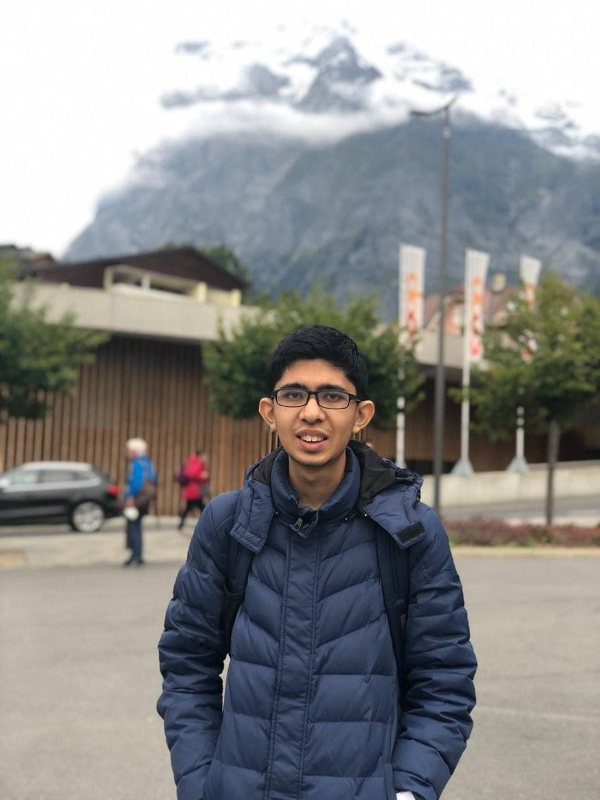

We are a team based in the [School of Computing, National University of Singapore](http://www.comp.nus.edu.sg).

You can reach us at the email `seer[at]comp.nus.edu.sg`

## Project Team

### Timothy Chua

[[github](https://github.com/ooawagaeri)]
[[portfolio](team/ooawagaeri.md)]

* Role: Scheduling and Tracking
* Responsibilities:
  * Focus on issues.
  * Defining, assigning, and tracking project tasks.
  * Ensuring everyone has manageable task.

### Hang Zelin

[[github](https://github.com/hangzelin)]
[[portfolio](team/hangzelin.md)]

* Role: Code Quality / Integration handler
* Responsibilities:
  * Pull request reviewer.
  * Merging of pull requests.
  * Ensure adherence to coding standards.

### Zhang Yubin

[[github](https://github.com/Kimowarui)]
[[portfolio](team/zhangyubin.md)]

* Role: Deliverables and Deadlines
* Responsibilities:
  * Focus on milestones page.
  * Update milestones according to CS2103 website.
  * Ensure project deliverables are done on time and in the right format.
  * Chase people if need be.

### Fan Tianhao

[[github](https://github.com/TTraveller7)]
[[portfolio](team/ttraveller7.md)]

* Role: Documents
* Responsibilities:
  * Ensure quality of various project documents
  * UI mockup and design

### Dhruv Shah

[[github](https://github.com/dhshah1)]
[[portfolio](team/dhshah1.md)]

* Role: Tester
* Responsibilities:
  * Ensure proper tests are written for all modules
  * Ensure new features/modules don't introduce bugs
  * Ensure application works as expected
