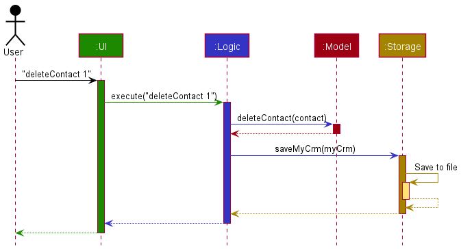
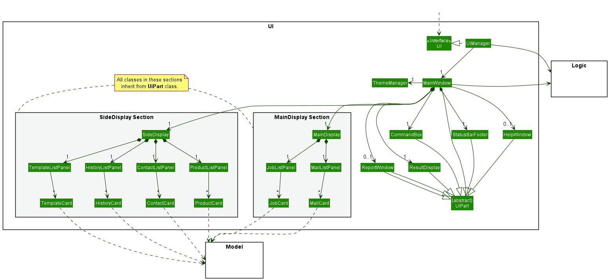
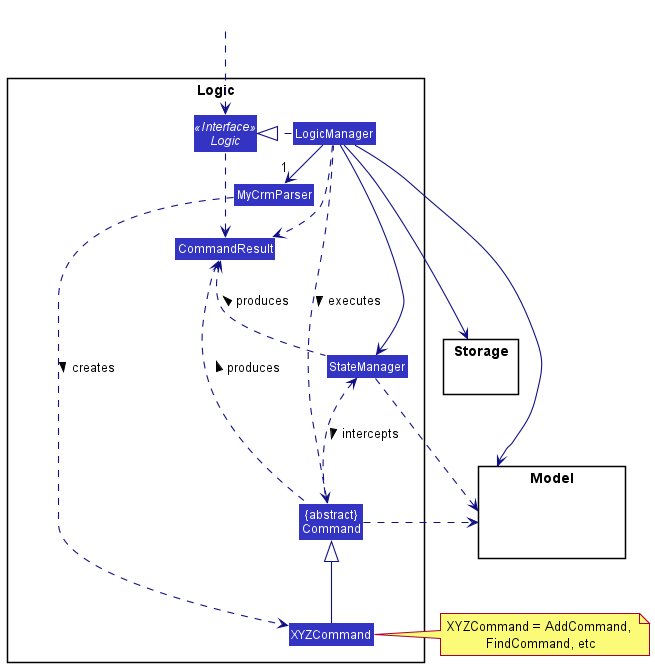
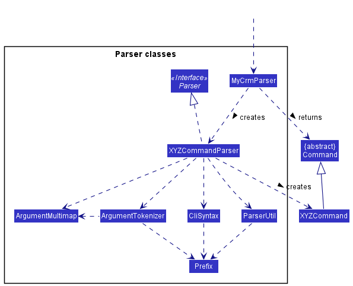
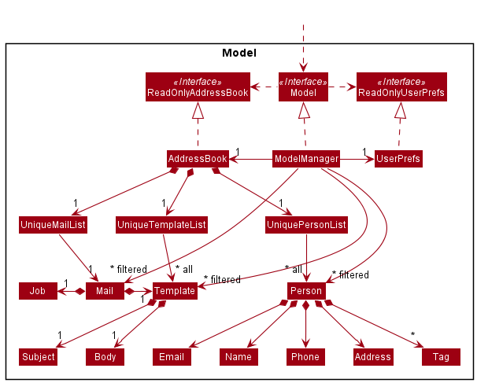
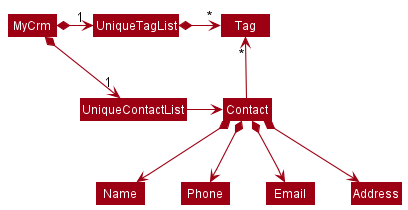
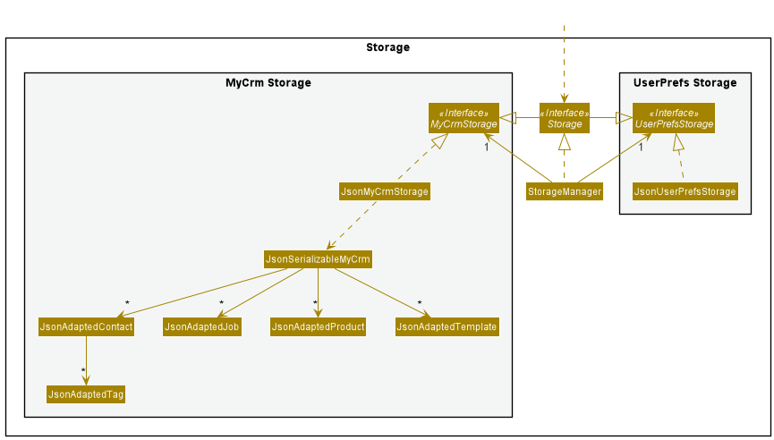

* Table of Contents 
{:toc}

--------------------------------------------------------------------------------------------------------------------

## **Acknowledgements**

* {list here sources of all reused/adapted ideas, code, documentation, and third-party libraries -- include links to the original source as well}

--------------------------------------------------------------------------------------------------------------------

## **Setting up, getting started**

Refer to the guide [_Setting up and getting started_](SettingUp.md).

--------------------------------------------------------------------------------------------------------------------

## **Design**

:bulb: **Tip:** The `.puml` files used to create diagrams in this document can be found in the [diagrams](https://github.com/se-edu/addressbook-level3/tree/master/docs/diagrams/) folder. Refer to the [_PlantUML Tutorial_ at se-edu/guides](https://se-education.org/guides/tutorials/plantUml.html) to learn how to create and edit diagrams.

### Architecture

The ***Architecture Diagram*** given above explains the high-level design of the App.

Given below is a quick overview of main components and how they interact with each other.

**Main components of the architecture**

**`Main`** has two classes called [`Main`](https://github.com/se-edu/addressbook-level3/tree/master/src/main/java/seedu/address/Main.java) and [`MainApp`](https://github.com/se-edu/addressbook-level3/tree/master/src/main/java/seedu/address/MainApp.java). It is responsible for,
* At app launch: Initializes the components in the correct sequence, and connects them up with each other.
* At shut down: Shuts down the components and invokes cleanup methods where necessary.

[**`Commons`**](#common-classes) represents a collection of classes used by multiple other components.

The rest of the App consists of four components.

* [**`UI`**](#ui-component): The UI of the App.
* [**`Logic`**](#logic-component): The command executor.
* [**`Model`**](#model-component): Holds the data of the App in memory.
* [**`Storage`**](#storage-component): Reads data from, and writes data to, the hard disk.

**How the architecture components interact with each other**

The *Sequence Diagram* below shows how the components interact with each other for the scenario where the user issues the command `delete 1`.

Each of the four main components (also shown in the diagram above),

* defines its *API* in an `interface` with the same name as the Component.
* implements its functionality using a concrete `{Component Name}Manager` class (which follows the corresponding API `interface` mentioned in the previous point.

For example, the `Logic` component defines its API in the `Logic.java` interface and implements its functionality using the `LogicManager.java` class which follows the `Logic` interface. Other components interact with a given component through its interface rather than the concrete class (reason: to prevent outside component's being coupled to the implementation of a component), as illustrated in the (partial) class diagram below.

The sections below give more details of each component.

### UI component

The **API** of this component is specified in [`Ui.java`](https://github.com/se-edu/addressbook-level3/tree/master/src/main/java/seedu/address/ui/Ui.java)

The UI consists of a `MainWindow` that is made up of parts e.g.`CommandBox`, `ResultDisplay`, `PersonListPanel`, `StatusBarFooter` etc. All these, including the `MainWindow`, inherit from the abstract `UiPart` class which captures the commonalities between classes that represent parts of the visible GUI.

The `UI` component uses the JavaFx UI framework. The layout of these UI parts are defined in matching `.fxml` files that are in the `src/main/resources/view` folder. For example, the layout of the [`MainWindow`](https://github.com/se-edu/addressbook-level3/tree/master/src/main/java/seedu/address/ui/MainWindow.java) is specified in [`MainWindow.fxml`](https://github.com/se-edu/addressbook-level3/tree/master/src/main/resources/view/MainWindow.fxml)

The `UI` component,

* executes user commands using the `Logic` component.
* listens for changes to `Model` data so that the UI can be updated with the modified data.
* keeps a reference to the `Logic` component, because the `UI` relies on the `Logic` to execute commands.
* depends on some classes in the `Model` component, as it displays `Person` object residing in the `Model`.

### Logic component

**API** : [`Logic.java`](https://github.com/se-edu/addressbook-level3/tree/master/src/main/java/seedu/address/logic/Logic.java)

Here's a (partial) class diagram of the `Logic` component:

How the `Logic` component works:
1. When `Logic` is called upon to execute a command, it uses the `AddressBookParser` class to parse the user command.
1. This results in a `Command` object (more precisely, an object of one of its subclasses e.g., `AddCommand`) which is executed by the `LogicManager`.
1. The command can communicate with the `Model` when it is executed (e.g. to add a person).
1. The result of the command execution is encapsulated as a `CommandResult` object which is returned back from `Logic`.

The Sequence Diagram below illustrates the interactions within the `Logic` component for the `execute("delete 1")` API call.

:information_source: **Note:** The lifeline for `DeleteCommandParser` should end at the destroy marker (X) but due to a limitation of PlantUML, the lifeline reaches the end of diagram.

Here are the other classes in `Logic` (omitted from the class diagram above) that are used for parsing a user command:

How the parsing works:
* When called upon to parse a user command, the `AddressBookParser` class creates an `XYZCommandParser` (`XYZ` is a placeholder for the specific command name e.g., `AddCommandParser`) which uses the other classes shown above to parse the user command and create a `XYZCommand` object (e.g., `AddCommand`) which the `AddressBookParser` returns back as a `Command` object.
* All `XYZCommandParser` classes (e.g., `AddCommandParser`, `DeleteCommandParser`, ...) inherit from the `Parser` interface so that they can be treated similarly where possible e.g, during testing.

### Model component
**API** : [`Model.java`](https://github.com/se-edu/addressbook-level3/tree/master/src/main/java/seedu/address/model/Model.java)

The `Model` component,

* stores the address book data i.e., all `Person` objects (which are contained in a `UniquePersonList` object).
* stores the currently 'selected' `Person` objects (e.g., results of a search query) as a separate _filtered_ list which is exposed to outsiders as an unmodifiable `ObservableList<Person>` that can be 'observed' e.g. the UI can be bound to this list so that the UI automatically updates when the data in the list change.
* stores a `UserPref` object that represents the user’s preferences. This is exposed to the outside as a `ReadOnlyUserPref` objects.
* does not depend on any of the other three components (as the `Model` represents data entities of the domain, they should make sense on their own without depending on other components)

:information_source: **Note:** An alternative (arguably, a more OOP) model is given below. It has a `Tag` list in the `AddressBook`, which `Person` references. This allows `AddressBook` to only require one `Tag` object per unique tag, instead of each `Person` needing their own `Tag` objects. 

### Storage component

**API** : [`Storage.java`](https://github.com/se-edu/addressbook-level3/tree/master/src/main/java/seedu/address/storage/Storage.java)

The `Storage` component,
* can save both address book data and user preference data in json format, and read them back into corresponding objects.
* inherits from both `AddressBookStorage` and `UserPrefStorage`, which means it can be treated as either one (if only the functionality of only one is needed).
* depends on some classes in the `Model` component (because the `Storage` component's job is to save/retrieve objects that belong to the `Model`)

### Common classes

Classes used by multiple components are in the `seedu.addressbook.commons` package.

--------------------------------------------------------------------------------------------------------------------

## **Implementation**

This section describes some noteworthy details on how certain features are implemented.

### \[Proposed\] Undo/redo feature

#### Proposed Implementation

The proposed undo/redo mechanism is facilitated by `VersionedAddressBook`. It extends `AddressBook` with an undo/redo history, stored internally as an `addressBookStateList` and `currentStatePointer`. Additionally, it implements the following operations:

* `VersionedAddressBook#commit()` — Saves the current address book state in its history.
* `VersionedAddressBook#undo()` — Restores the previous address book state from its history.
* `VersionedAddressBook#redo()` — Restores a previously undone address book state from its history.

These operations are exposed in the `Model` interface as `Model#commitAddressBook()`, `Model#undoAddressBook()` and `Model#redoAddressBook()` respectively.

Given below is an example usage scenario and how the undo/redo mechanism behaves at each step.

Step 1. The user launches the application for the first time. The `VersionedAddressBook` will be initialized with the initial address book state, and the `currentStatePointer` pointing to that single address book state.

Step 2. The user executes `delete 5` command to delete the 5th person in the address book. The `delete` command calls `Model#commitAddressBook()`, causing the modified state of the address book after the `delete 5` command executes to be saved in the `addressBookStateList`, and the `currentStatePointer` is shifted to the newly inserted address book state.

Step 3. The user executes `add n/David …​` to add a new person. The `add` command also calls `Model#commitAddressBook()`, causing another modified address book state to be saved into the `addressBookStateList`.

:information_source: **Note:** If a command fails its execution, it will not call `Model#commitAddressBook()`, so the address book state will not be saved into the `addressBookStateList`.

Step 4. The user now decides that adding the person was a mistake, and decides to undo that action by executing the `undo` command. The `undo` command will call `Model#undoAddressBook()`, which will shift the `currentStatePointer` once to the left, pointing it to the previous address book state, and restores the address book to that state.

:information_source: **Note:** If the `currentStatePointer` is at index 0, pointing to the initial AddressBook state, then there are no previous AddressBook states to restore. The `undo` command uses `Model#canUndoAddressBook()` to check if this is the case. If so, it will return an error to the user rather
than attempting to perform the undo.

The following sequence diagram shows how the undo operation works:

:information_source: **Note:** The lifeline for `UndoCommand` should end at the destroy marker (X) but due to a limitation of PlantUML, the lifeline reaches the end of diagram.

The `redo` command does the opposite — it calls `Model#redoAddressBook()`, which shifts the `currentStatePointer` once to the right, pointing to the previously undone state, and restores the address book to that state.

:information_source: **Note:** If the `currentStatePointer` is at index `addressBookStateList.size() - 1`, pointing to the latest address book state, then there are no undone AddressBook states to restore. The `redo` command uses `Model#canRedoAddressBook()` to check if this is the case. If so, it will return an error to the user rather than attempting to perform the redo.

Step 5. The user then decides to execute the command `list`. Commands that do not modify the address book, such as `list`, will usually not call `Model#commitAddressBook()`, `Model#undoAddressBook()` or `Model#redoAddressBook()`. Thus, the `addressBookStateList` remains unchanged.

Step 6. The user executes `clear`, which calls `Model#commitAddressBook()`. Since the `currentStatePointer` is not pointing at the end of the `addressBookStateList`, all address book states after the `currentStatePointer` will be purged. Reason: It no longer makes sense to redo the `add n/David …​` command. This is the behavior that most modern desktop applications follow.

The following activity diagram summarizes what happens when a user executes a new command:

#### Design considerations:

**Aspect: How undo & redo executes:**

* **Alternative 1 (current choice):** Saves the entire address book.
  * Pros: Easy to implement.
  * Cons: May have performance issues in terms of memory usage.

* **Alternative 2:** Individual command knows how to undo/redo by
  itself.
  * Pros: Will use less memory (e.g. for `delete`, just save the person being deleted).
  * Cons: We must ensure that the implementation of each individual command are correct.

_{more aspects and alternatives to be added}_

### \[Proposed\] Data archiving

_{Explain here how the data archiving feature will be implemented}_

--------------------------------------------------------------------------------------------------------------------

## **Documentation, logging, testing, configuration, dev-ops**

* [Documentation guide](Documentation.md)
* [Testing guide](Testing.md)
* [Logging guide](Logging.md)
* [Configuration guide](Configuration.md)
* [DevOps guide](DevOps.md)

--------------------------------------------------------------------------------------------------------------------

## **Appendix: Requirements**

### Product scope

**Target user profile**:

* is a tech-savvy computer repair shop technician.
* owns a business repairing computers and laptops, actively servicing multiple clients and answering their queries.
* has a need to manage a wide range of models and deals with both hardware and software issues.
* has multiple repair-phases which have to be updated to clients.
* prefer desktop apps over other types
* can type fast
* prefers typing to mouse interactions
* is reasonably comfortable using CLI apps

**Value proposition**:

* manages clients and jobs faster than a typical mouse/GUI driven app
* centralizes jobs and client information
* integrates both status tracking and client notification/mailing
* automates monthly reports and statistics generation

### User stories

Priorities: High (must have) - `* * *`, Medium (nice to have) - `* *`, Low (unlikely to have) - `*`

| Priority | As a …​             | I want to …​                                           | So that I can…​                                                    |
| -------- | ---------------------- | --------------------------------------------------------- | --------------------------------------------------------------------- |
| `*`      | potential user         | see the app populated with sample data                    | easily see how the app will look like when it is in use               |
| `*`      | user ready to start    | purge all current data                                    | Get rid of sample data and begin tinkering / exploring the app        |
| `* *`    | new user               | view a guide                                              | familiarize with the text-input commands                              |
| `* * *`  | user                   | send out emails                                           | easily notify clients that their repair job has been completed        |
| `* * *`  | user                   | create new jobs                                           | begin tracking a new repair job                                       |
| `* * *`  | user                   | edit existing jobs                                        | amend details pertaining to a job                                     |
| `* * *`  | user                   | create new contacts                                       | notify a client of his/her job status (like completion, etc.)         |
| `* * *`  | user                   | edit existing contacts                                    | change information about a client                                     |
| `* * *`  | user                   | link an existing contact to a job                         | reuse the contact information of a returning client for a new job     |
| `* * *`  | user                   | create new products                                       | refer to the relevant details of how to repair a specific device      |
| `* * *`  | user                   | edit existing products                                    | change repair details or method about a product                       |
| `* * *`  | user                   | link an existing product to a job                         | reuse the product information of  a previous for a new job            |
| `* * *`  | user                   | search for jobs using job status, service tag, client name or product name | find the jobs that match the specification           |
| `* *`    | regular user           | print out monthly job records and statistics              | learn about the month’s performance and analyze how to improve        |
| `* *`    | regular user           | print out next month’s scheduled / on-going job           | plan ahead resources for the coming month                             |
| `*`      | regular user           | hide unused job fields                                    | not be distracted by empty / irrelevant fields.                       |
| `*`      | regular user           | hide unused contacts                                      | not be distracted by irrelevant clients.                              |
| `*`      | regular user           | customize the app’s user interface (like font and colour) | make the interface look more stylish and pleasant for the eyes        |
| `*`      | regular user           | pin jobs I am working on / are urgent                     | easily check and view the job’s details                               |
| `* *`    | regular user           | export my monthly records and statistics                  | store my record externally for future reference                       |

### Use cases

(For all use cases below, the **System** is the `MyCRM` and the **Actor** is the `user`, unless specified otherwise)

**Use case: UC05 - Adding a contact**

**MSS**

1. User requests to add a contact with specific info of name, contact number, address, and email.
2. MyCRM stores the new contact in the contact list.

    Use case ends.

**Extensions**

* 1a. The given contact name is empty.
  
  * 1a1. MyCRM shows an error message.  

    Use case resumes at step 1.

* 1b. Either the given contact number, address or email is empty.
  
  * 1b1. MyCRM shows an error message.  

    Use case resumes at step 1.
  
* 1c. The given contact name already exists.
  
  * 1c1. MyCRM shows an error message.  

    Use case resumes at step 1.
  
**Use case: UC06 - Editing a contact**

**MSS**

1. User requests to edit a contact.
2. MyCRM shows a list of contacts.
3. User requests to edit a specific contact's info with specific index and type of the field in contact.
4. MyCRM updates this specifc contact's info.

    Use case ends.

**Extensions**

* 2a. The list is empty.

  Use case ends.

* 3a. The given index is invalid.

    * 3a1. MyCRM shows an error message.

      Use case resumes at step 2.
      
* 3b. The given edit field type is invaild.

    * 3b1. MyCRM shows an error message.

      Use case resumes at step 2.
      
**Use case: UC07 - Deleting a contact**

**MSS**

1. User requests to delete a contact.
2. MyCRM shows a list of contacts.
3. User requests to delete a specific contact
4. MyCRM deletes the contact.

    Use case ends.

**Extensions**

* 2a. The list is empty.

  Use case ends.

* 3a. The given index is invalid.

    * 3a1. MyCRM shows an error message.

      Use case resumes at step 2.

**Use case: UC08 - Linking a contact to a job**

**MSS**

1. User requests to link a contact to a job.
2. MyCRM shows a list of contacts.
3. User requests to use a specifc contact to link a job.
4. MyCRM shows a list of jobs.
5. User requests to link to a specific job in the list.
6. MyCRM links the contact to this job.

    Use case ends.

**Extensions**

* 2a. The list is empty.

  Use case ends.

* 3a. The given index is invalid.

    * 3a1. MyCRM shows an error message.

      Use case resumes at step 2.
      
* 4a. The list is empty.

  Use case ends.

* 5a. The given index is invalid.

    * 5a1. MyCRM shows an error message.

      Use case resumes at step 4

**Use case: UC09 - Hiding a contact**

**MSS**

1. User requests to hide a contact.
2. MyCRM shows a list of contacts.
3. User requests to hide a specific contact in the list.
4. MyCRM tags the contact as hidden.

    Use case ends.

**Extensions**

* 2a. The list is empty.

  Use case ends.

* 3a. The given index is invalid.

    * 3a1. MyCRM shows an error message.

      Use case resumes at step 2.

**Use case: UC10 - Sending an email**

**MSS**

1. User requests to send an email.
2. MyCRM shows a list of jobs.
3. User requests to email a specific job in the list.
4. MyCRM shows a list of email templates.
5. User requests to copy a specific email template.
6. MyCRM generates mailto link of the job and template

    Use case ends.

**Extensions**

* 2a. The list is empty.

  Use case ends.

* 3a. The given index is invalid.

    * 3a1. MyCRM shows an error message.

      Use case resumes at step 2.
  
* 4a. The list is empty.

  Use case ends.

* 5a. The given index is invalid.

    * 3a1. MyCRM shows an error message.

      Use case resumes at step 4.
    
**Use case: UC11 - Adding an email template**

**MSS**

1. User requests to add an email template with specific subject and body.
2. MyCRM creates email template.

   Use case ends.

**Extensions**

* 1a. The given subject is empty.

    * 1a1. MyCRM shows an error message.

      Use case resumes at step 1.

* 1b. The given body is empty.

    * 1b1. MyCRM shows an error message.

      Use case resumes at step 1.

**Use case: UC12 - Listing all email template**

**MSS**

1. User requests to view all email template.
2. MyCRM shows a list of email template.

   Use case ends.

**Use case: UC13 - Deleting an email template**

**MSS**

1. User requests to delete an email template.
2. MyCRM shows a list of email template.
3. User requests to delete a specific template in the list.
4. MyCRM shows deletes the template.

   Use case ends.

**Extensions**

* 2a. The list is empty.

  Use case ends.

* 3a. The given index is invalid.

    * 3a1. MyCRM shows an error message.

      Use case resumes at step 2.

**Use case: UC14 - Viewing user guide**

**MSS**

1. User requests to view the user guide.
2. MyCRM shows a popup with the GitHub user guide URL.

   Use case ends.

**Use case: UC15 - Exiting the program**

**MSS**

1. User requests to exit MyCRM.
2. MyCRM shows a goodbye message.

   Use case ends.

**Use case: UC16 - Loading from JSON file**

**MSS**

1. User request to load data from a specific JSON file.
2. MyCRM loads data from JSON file data into job, contact, product list.

   Use case ends.

**Extensions**

* 1a. The JSON file does not exist.

    * 1a1. MyCRM shows an error message.

      Use case ends.

* 1b. The JSON file's content fails to parse.

    * 1b1. MyCRM shows an error message.

      Use case ends.

**Use case: UC17 - Purging MyCRM data**

**Precondition:** Data in MyCRM (job, contact and product list) is not empty. 

**MSS**

1. User request to purge data.
2. MyCRM removes data from job, contact, product list.

   Use case ends.

**Use case: UC18 - Add Product**

**MSS**

1. User requests to add a new product.
2. MyCRM creates a new product and shows a message with info of the product.

    Use case ends.
   
**Extensions** 

* 2a. The product name already exists.
    * MyCRM shows an error message.
    
    Use case ends.
  

* 2b. The product name is empty.
    * MyCRM shows an error message.
    
    Use case ends.

**Use case: UC19 - List Products**

**MSS**

1. User requests to list products.
2. MyCRM shows a list of products.

   Use case ends.

**Extensions**
* 2a. The list of products is empty.

  Use case ends.

**Use case: UC20: Delete a product**

**MSS**

1. User <u>requests to list products (UC19)</u>.
2. User requests to delete a specific product in the list.
3. MyCRM deletes the product.
    
    Use case ends.

**Extensions**

* 2a. The given index is invalid.
    * 2a1. MyCRM shows an error message.
    
    Use case resumes at <u>step 2 in UC19</u>.

**Use case: UC 21: Edit a product.**

**MSS**

1. User <u>requests to list products (UC19)</u>.
2. User requests to edit a specific product in the list.
3. MyCRM edits the product and shows a message with edited information of the product.

   Use case ends.

**Extensions**
* 2a. The given index is invalid.
    * 2a1. MyCRM shows an error message.

  Use case resumes at <u>step 2 in UC19</u>.

* 2b. User requests to edit the name of the product.
    * 2b1. The product name already exists
    * 2b2. MyCRM shows an error message.

  Use case resumes at <u>step 2 in UC19</u>.

* 2c. User requests to edit the name of the product.
    * 2c1. The product name is unique.
    
    Use case resumes at step 3.
    

### Non-Functional Requirements

1. Should work on any _mainstream OS_ as long as it has Java `11` or above installed.
2. Should be able to hold up to 100 _entries_ without a noticeable sluggishness in performance for typical usage.
3. Should be designed for a single-user.
4. Should work without an internet connection.
5. Should be accessible via the downloaded JAR file without any other installations needed.
6. Should take up less than 50MB computer storage.
    <!--- This is an arbitrary number. Can be updated later. --> 
7. Should work on both 32-bit and 64-bit environments.
8. A user with above average typing speed for regular English text (i.e. not code, not system admin commands)
   should be able to accomplish most of the tasks faster using commands than using the mouse.

<!--- More to be added -->

### Glossary

* **Mainstream OS**: Windows, Linux, Unix, OS-X.
* **Private contact detail**: A contact detail that is not meant to be shared with others.
* **Repair Job**: A customer request to restore machinery, equipment, or other products to working order.
* **Job Status**: A progress bar showing the customer's job's degree of completion.
* **JSON**: Javascript Standard Object Notation, which is a form of syntax used for storing data.
* **mailto**: A Uniform Resource Identifier scheme for email addresses, produces hyperlinks on websites that allow
  users to send an email.
* **Entry**: Contact/job/product.

--------------------------------------------------------------------------------------------------------------------

## **Appendix: Instructions for manual testing**

Given below are instructions to test the app manually.

:information_source: **Note:** These instructions only provide a starting point for testers to work on;
testers are expected to do more *exploratory* testing.

### Launch and shutdown

1. Initial launch

   1. Download the jar file and copy into an empty folder

   1. Double-click the jar file Expected: Shows the GUI with a set of sample contacts. The window size may not be optimum.

1. Saving window preferences

   1. Resize the window to an optimum size. Move the window to a different location. Close the window.

   1. Re-launch the app by double-clicking the jar file. 
       Expected: The most recent window size and location is retained.

1. _{ more test cases …​ }_

### Deleting a person

1. Deleting a person while all persons are being shown

   1. Prerequisites: List all persons using the `list` command. Multiple persons in the list.

   1. Test case: `delete 1` 
      Expected: First contact is deleted from the list. Details of the deleted contact shown in the status message. Timestamp in the status bar is updated.

   1. Test case: `delete 0` 
      Expected: No person is deleted. Error details shown in the status message. Status bar remains the same.

   1. Other incorrect delete commands to try: `delete`, `delete x`, `...` (where x is larger than the list size) 
      Expected: Similar to previous.

1. _{ more test cases …​ }_

### Saving data

1. Dealing with missing/corrupted data files

   1. _{explain how to simulate a missing/corrupted file, and the expected behavior}_

1. _{ more test cases …​ }_
