* Table of Contents 
{:toc}

--------------------------------------------------------------------------------------------------------------------

## **Acknowledgements**

* {list here sources of all reused/adapted ideas, code, documentation, and third-party libraries -- include links to the original source as well}

--------------------------------------------------------------------------------------------------------------------

## **Setting up, getting started**

Refer to the guide [_Setting up and getting started_](SettingUp.md).

--------------------------------------------------------------------------------------------------------------------

## **Design**

:bulb: **Tip:** The `.puml` files used to create diagrams in this document can be found in the [diagrams](https://github.com/se-edu/addressbook-level3/tree/master/docs/diagrams/) folder. Refer to the [_PlantUML Tutorial_ at se-edu/guides](https://se-education.org/guides/tutorials/plantUml.html) to learn how to create and edit diagrams.

### Architecture

The ***Architecture Diagram*** given above explains the high-level design of the App.

Given below is a quick overview of main components and how they interact with each other.

**Main components of the architecture**

**`Main`** has two classes called [`Main`](https://github.com/se-edu/addressbook-level3/tree/master/src/main/java/seedu/address/Main.java) and [`MainApp`](https://github.com/se-edu/addressbook-level3/tree/master/src/main/java/seedu/address/MainApp.java). It is responsible for,
* At app launch: Initializes the components in the correct sequence, and connects them up with each other.
* At shut down: Shuts down the components and invokes cleanup methods where necessary.

[**`Commons`**](#common-classes) represents a collection of classes used by multiple other components.

The rest of the App consists of four components.

* [**`UI`**](#ui-component): The UI of the App.
* [**`Logic`**](#logic-component): The command executor.
* [**`Model`**](#model-component): Holds the data of the App in memory.
* [**`Storage`**](#storage-component): Reads data from, and writes data to, the hard disk.

**How the architecture components interact with each other**

The *Sequence Diagram* below shows how the components interact with each other for the scenario where the user issues the command `delete 1`.

Each of the four main components (also shown in the diagram above),

* defines its *API* in an `interface` with the same name as the Component.
* implements its functionality using a concrete `{Component Name}Manager` class (which follows the corresponding API `interface` mentioned in the previous point.

For example, the `Logic` component defines its API in the `Logic.java` interface and implements its functionality using the `LogicManager.java` class which follows the `Logic` interface. Other components interact with a given component through its interface rather than the concrete class (reason: to prevent outside component's being coupled to the implementation of a component), as illustrated in the (partial) class diagram below.

The sections below give more details of each component.

### UI component

The **API** of this component is specified in [`Ui.java`](https://github.com/AY2122S1-CS2103-T14-3/tp/blob/master/src/main/java/seedu/mycrm/ui/Ui.java)

The UI consists of a `MainWindow` that is made up of parts e.g.`CommandBox`, `ResultDisplay`, `MainDisplay`, 
`StatusBarFooter` etc. All these, including the `MainWindow`, inherit from the abstract `UiPart` class which captures 
the commonalities between classes that represent parts of the visible GUI.

The `UI` component uses the JavaFx UI framework. The layout of these UI parts are defined in matching `.fxml` files that 
are in the `src/main/resources/view` folder. For example, the layout of the 
[`MainWindow`](https://github.com/AY2122S1-CS2103-T14-3/tp/blob/master/src/main/java/seedu/mycrm/ui/MainWindow.java) 
is specified in [`MainWindow.fxml`](https://github.com/AY2122S1-CS2103-T14-3/tp/blob/master/src/main/resources/view/MainWindow.fxml)

The `UI` component,

* executes user commands using the `Logic` component.
* listens for changes to `Model` data so that the UI can be updated with the modified data.
* keeps a reference to the `Logic` component, because the `UI` relies on the `Logic` to execute commands.
* depends on some classes in the `Model` component, as it displays `Job`, `Contact`, `Product`, `Template`, `History` 
  objects residing in the `Model`.

### Logic component

**API** : [`Logic.java`](https://github.com/se-edu/addressbook-level3/tree/master/src/main/java/seedu/address/logic/Logic.java)

Here's a (partial) class diagram of the `Logic` component:

How the `Logic` component works:
1. When `Logic` is called upon to execute a command, it uses the `AddressBookParser` class to parse the user command.
1. This results in a `Command` object (more precisely, an object of one of its subclasses e.g., `AddCommand`) which is executed by the `LogicManager`.
1. The command can communicate with the `Model` when it is executed (e.g. to add a person).
1. The result of the command execution is encapsulated as a `CommandResult` object which is returned back from `Logic`.

The Sequence Diagram below illustrates the interactions within the `Logic` component for the `execute("delete 1")` API call.

:information_source: **Note:** The lifeline for `DeleteCommandParser` should end at the destroy marker (X) but due to a limitation of PlantUML, the lifeline reaches the end of diagram.

Here are the other classes in `Logic` (omitted from the class diagram above) that are used for parsing a user command:

How the parsing works:
* When called upon to parse a user command, the `AddressBookParser` class creates an `XYZCommandParser` (`XYZ` is a placeholder for the specific command name e.g., `AddCommandParser`) which uses the other classes shown above to parse the user command and create a `XYZCommand` object (e.g., `AddCommand`) which the `AddressBookParser` returns back as a `Command` object.
* All `XYZCommandParser` classes (e.g., `AddCommandParser`, `DeleteCommandParser`, ...) inherit from the `Parser` interface so that they can be treated similarly where possible e.g, during testing.

### Model component
**API** : [`Model.java`](https://github.com/se-edu/addressbook-level3/tree/master/src/main/java/seedu/address/model/Model.java)

The `Model` component,

* stores the address book data i.e., all `Person` objects (which are contained in a `UniquePersonList` object).
* stores the currently 'selected' `Person` objects (e.g., results of a search query) as a separate _filtered_ list which is exposed to outsiders as an unmodifiable `ObservableList<Person>` that can be 'observed' e.g. the UI can be bound to this list so that the UI automatically updates when the data in the list change.
* stores a `UserPref` object that represents the user’s preferences. This is exposed to the outside as a `ReadOnlyUserPref` objects.
* does not depend on any of the other three components (as the `Model` represents data entities of the domain, they should make sense on their own without depending on other components)

:information_source: **Note:** An alternative (arguably, a more OOP) model is given below. It has a `Tag` list in the `AddressBook`, which `Person` references. This allows `AddressBook` to only require one `Tag` object per unique tag, instead of each `Person` needing their own `Tag` objects. 

### Storage component

**API** : [`Storage.java`](https://github.com/se-edu/addressbook-level3/tree/master/src/main/java/seedu/address/storage/Storage.java)

The `Storage` component,
* can save both address book data and user preference data in json format, and read them back into corresponding objects.
* inherits from both `AddressBookStorage` and `UserPrefStorage`, which means it can be treated as either one (if only the functionality of only one is needed).
* depends on some classes in the `Model` component (because the `Storage` component's job is to save/retrieve objects that belong to the `Model`)

### Common classes

Classes used by multiple components are in the `seedu.addressbook.commons` package.

--------------------------------------------------------------------------------------------------------------------

## **Implementation**

This section describes some noteworthy details on how certain features are implemented.

* [Adding a contact](#adding-a-contact)
* [Hiding a contact](#hiding-a-contact)
* [Listing contacts](#listing-contacts)
* [Adding a template](#adding-a-template)
* [Deleting a template](#deleting-a-template)
* [Constructing an email](#constructing-an-email)

### Adding a Contact

#### Implementation

The adding a contact mechanism is facilitated by `MyCRM`. This Contact created is stored internally using 
`UniqueContactList` inside the `MyCrm` object.  
Additionally, `addContact` allows to have only partially info of a client with consideration of privacy. Commands
such as `AddContact n/xxx e/xxx` `addContact n/xxx c/xxx` are all acceptable.

#### Usage

The activity diagram below illustrates how the events of `addContact` command behave when executed by a user: 

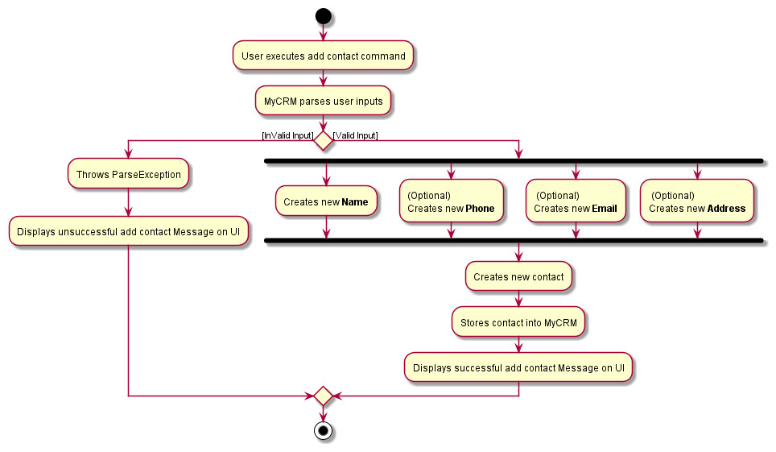

Given below is an example usage scenario and how the adding a contact mechanism behaves at each step.

Within `AddContactCommandParser#parse`, `ParserUtil#parseName` will be called to create a name using 
"Sans", `ParserUtil#parsePhone` to create a phone using "83921823", `ParserUtil#parseEmail` to 
create an email using "Sans@gmail.com", `ParserUtil#parseAddress` to create an address using "Maxwell...".  
Then create a contact using the new name, phone, email and address.

Note that `Phone`, `Email`, `Address`, are optional, but at least one of these 3 fields
must exist.

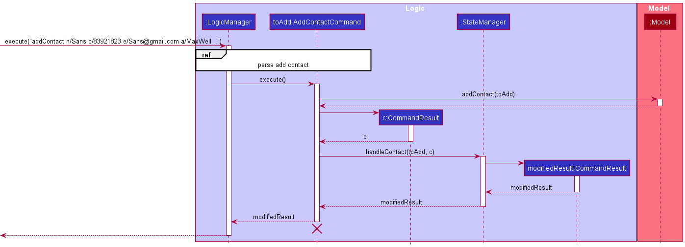

### Editing a Contact

#### Implementation

The Editing a Contact mechanism is facilitated by `MyCRM`. This mechanism reads and modifies a target contact
object from `UniqueContactList` inside the `MyCRM` object.

#### Usage

The activity diagram below illustrates how the events of `editContact` command behave when executed by a user:

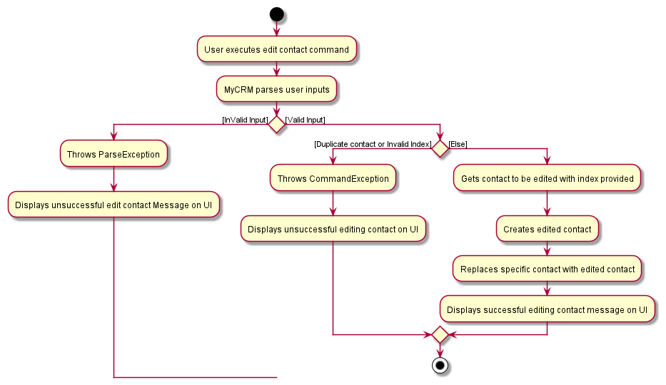

Given below is an example usage scenario and how the adding a contact mechanism behaves at each step.

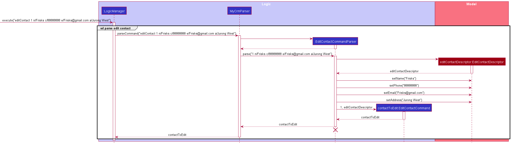

Within `EditContactCommandParser#parse`,
- `Index` must be is valid (within the range of contactList).
- `EditContactDescriptor` will only get the values of `Name`, `Phone`, `Email`, `Address`, and `Tags` 
if their respective prefixes are present.
- `isHidden` is will not be handled by `EditContactDescrptior`, it will be updated in `createEditedContact`.

`EditContactCommandParser#parse` will call `ArgumentMultimap#getPreamble` to get the target contact's index and
`ArgumentMultimap#getValue` to extract `Name`, `Phone`, `Email`, `Address`: "Frisks", "88888888", "Frisks@gmail.com"
and "Jurong West" from the command string respectively.

### Deleting a Contact

#### Implementation

### Finding a Contact

#### Implementation

### Hiding a Contact

#### Implementation

The Hiding a Contact mechanism follows the `EditCommand` mechanism in `AddressBook`. It hides a specific contact
which is visible only when user types the command `listContact -a`. Hidden contact will be tagged as `Hidden`. The
Edited contact created is stored internally using `UniqueContactList` inside the `MyCrm` object

### Undoing Hiding a Contact

Implementation and usage details are similar to [Hiding a Contact](#hiding-a-contact) design
pattern. Please refer to `hideContact` command implementation details.

### Listing Contacts

#### Implementation

### Adding a Template

#### Implementation

The Adding a Template mechanism is facilitated by `MyCRM`. This template created is stored internally using
`UniqueTemplateList` inside the `MyCRM` object. 

#### Usage

The activity diagram below illustrates how the events of `addTemplate` command behave when executed by user:

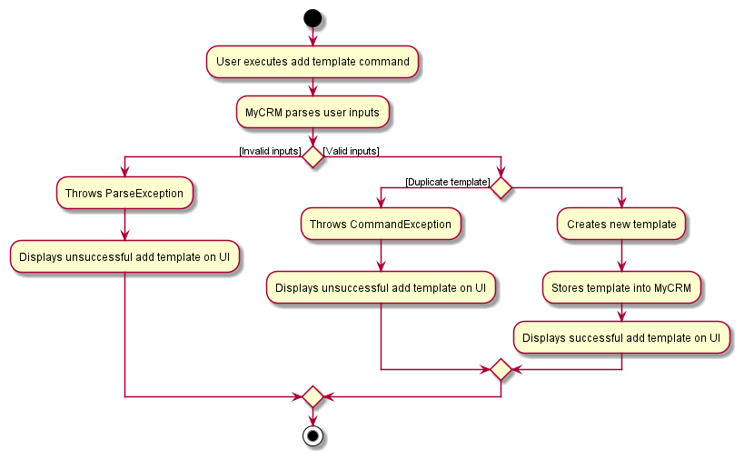

Given below is an example usage scenario and how the Adding a Template mechanism behaves at each step.

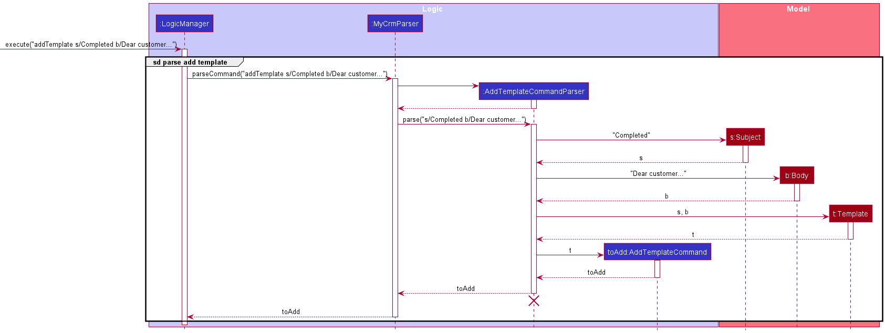

:information_source: **Note:** The lifeline for 
`AddTemplateCommandParser` should end at the destroy marker (X) but due to a limitation of PlantUML, the lifeline 
reaches the end of diagram.

Within `AddTemplateCommandParser#parse`, `ParserUtil#parseSubject` will be called to create a subject using 
"Completed", `ParserUtil#parseBody` to create a body using "Dear customer..." and create a template using the new
subject and body.

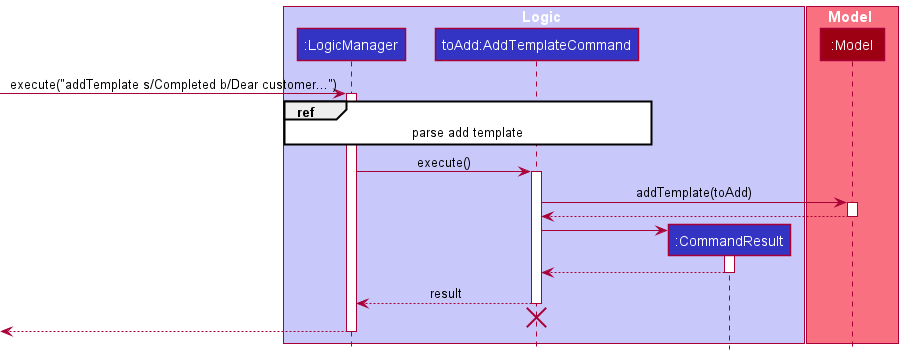

Additionally, before adding the new template into `Model`, `Template t` will be checked if a similar copy exist
within `Model`. The conditions required is:

* If both templates have the DO NOT same `Subject` content i.e. there is an existing template with subject "Completed".

#### Design Considerations

**Aspect: Unique Template**

* Current choice: Unique by Subject
  * Pros: Easy to understand and differentiate templates
  * Cons: Does not allow for different variations of general / common email headers i.e. "Completed" subject header 
    cannot be reused with different body content based on scenario
* Alternative: Unique by Subject and Body
  * Pros: Enables different variations of general / common email headers
  * Cons: May not be user-friendly as it may be hard to differentiate templates as some may be too similar at first 
    glance. Such as, minor typos, copy and paste with a couple of different words. Higher risk of confusion.    

### Editing a Template

#### Implementation

The Editing a Template mechanism is facilitated by `MyCRM`. This mechanism reads and modifies a target template 
object from `UniqueTemplateList` inside the `MyCRM` object.

#### Usage

The activity diagram below illustrates how the events of `editTemplate` command behave when executed by user:

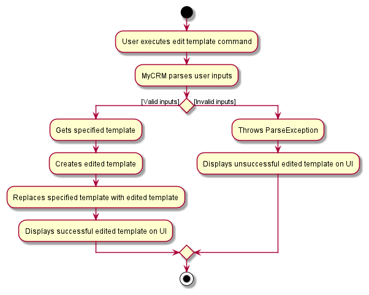

Given below is an example usage scenario and how the Editing a Template mechanism behaves at each step.

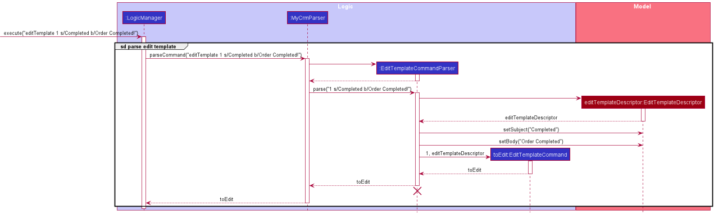

Within `EditTemplateCommandParser#parse`,
- `Index` must be is valid (within the range of templates).
- `EditTemplateDescriptor` will only get the values of `Subject` and `Body` if their respective prefixes are present. 

`EditTemplateCommandParser#parse` will call `ArgumentMultimap#getPreamble` to get the specified template index and 
`ArgumentMultimap#getValue` to extract both `Subject` and `Body`: "Completed" and "Order Completed!" from the 
command string respectively.

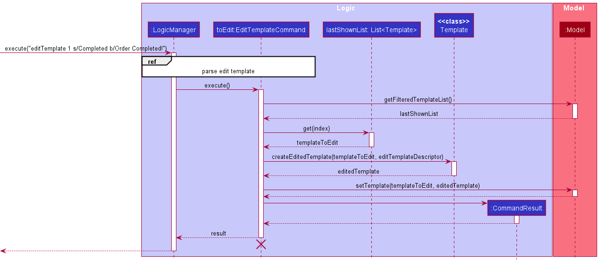

### Deleting a Template

#### Implementation

The Deleting a Template mechanism is facilitated by `MyCRM`. This template removes a target template object from
`UniqueTemplateList` inside the `MyCRM` object.

#### Usage

The activity diagram below illustrates how the events of `deleteTemplate` command behave when executed by user:

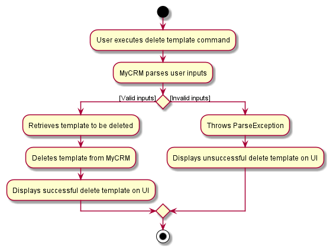

Given below is an example usage scenario and how the Deleting a Template mechanism behaves at each step.

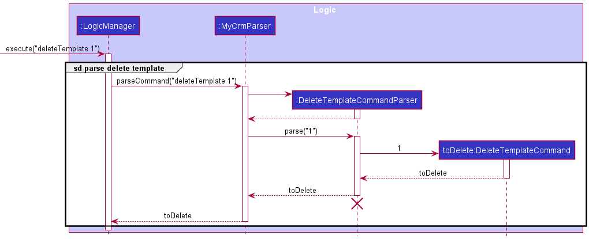

Within `DeleteTemplateCommandParser#parse`,
- `Index` must be is valid (within the range of templates) and at least one field to be edited, for the mechanism to
  execute successfully.
- `ParserUtil#parseIndex` will be called to extract the index of the specified template to delete.

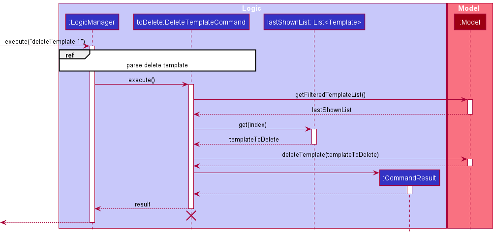

### Constructing an Email

#### Implementation

The Constructing an Email mechanism is facilitated by `MyCRM`. This email is constructed based of the information 
from a specified job and template from `UniqueJobList` and `UniqueTemplateList` inside the `MyCRM` object. A mailto URL 
will be generated, sending users to their default mailing application with details of the job and template. 

#### Usage

The activity diagram below illustrates how the events of `mail` command behave when executed by user:

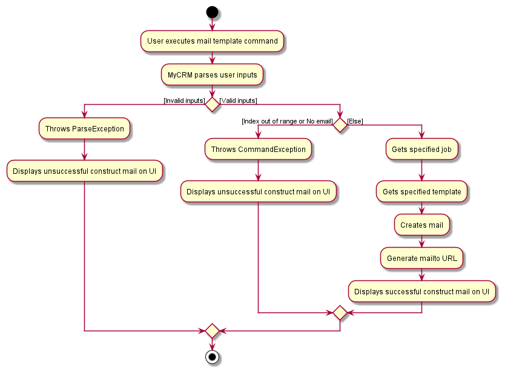

Given below is an example usage scenario and how the Constructing an Email mechanism behaves at each step.

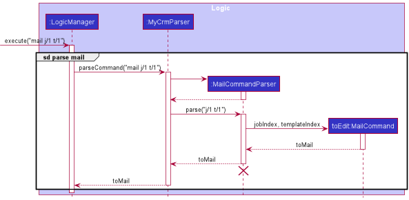

Within `MailCommandParser#parse`,
- `JobIndex` must be is valid (within the range of job).
- `TemplateIndex` must be is valid (within the range of templates).
- `ParserUtil#parseIndex` will be called to extract both the index of the specified job and template to mail.

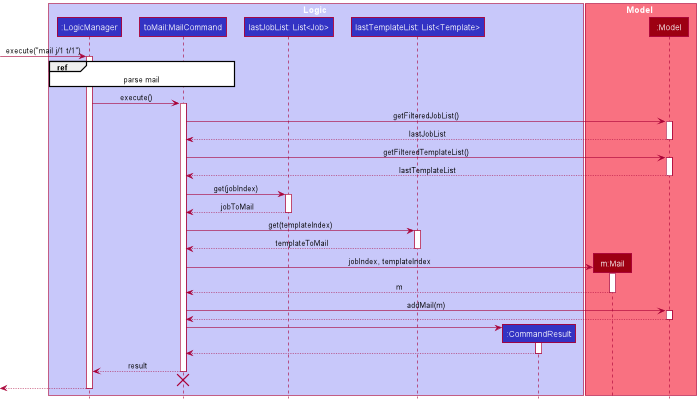

An additional feature of constructing an email is the generation of a mailto URL, allowing for users to transfer 
their job and template details to the user's default mailing application.

Given below is an example of the generation of a mailto URL:

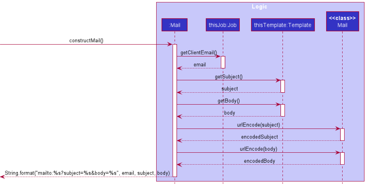

After the URL is generated, the URL string is passed to a JavaFX `Hyperlink` object that when clicked, will execute 
the URL path.

--------------------------------------------------------------------------------------------------------------------

## **Documentation, logging, testing, configuration, dev-ops**

* [Documentation guide](Documentation.md)
* [Testing guide](Testing.md)
* [Logging guide](Logging.md)
* [Configuration guide](Configuration.md)
* [DevOps guide](DevOps.md)

--------------------------------------------------------------------------------------------------------------------

## **Appendix: Requirements**

### Product scope

**Target user profile**:

* is a tech-savvy computer repair shop technician.
* owns a business repairing computers and laptops, actively servicing multiple clients and answering their queries.
* has a need to manage a wide range of models and deals with both hardware and software issues.
* has multiple repair-phases which have to be updated to clients.
* prefer desktop apps over other types
* can type fast
* prefers typing to mouse interactions
* is reasonably comfortable using CLI apps

**Value proposition**:

* manages clients and jobs faster than a typical mouse/GUI driven app
* centralizes jobs and client information
* integrates both status tracking and client notification/mailing
* automates monthly reports and statistics generation

### User stories

Priorities: High (must have) - `* * *`, Medium (nice to have) - `* *`, Low (unlikely to have) - `*`

| Priority | As a …​             | I want to …​                                           | So that I can…​                                                    |
| -------- | ---------------------- | --------------------------------------------------------- | --------------------------------------------------------------------- |
| `*`      | potential user         | see the app populated with sample data                    | easily see how the app will look like when it is in use               |
| `*`      | user ready to start    | purge all current data                                    | Get rid of sample data and begin tinkering / exploring the app        |
| `* *`    | new user               | view a guide                                              | familiarize with the text-input commands                              |
| `* * *`  | user                   | send out emails                                           | easily notify clients that their repair job has been completed        |
| `* * *`  | user                   | create new jobs                                           | begin tracking a new repair job                                       |
| `* * *`  | user                   | edit existing jobs                                        | amend details pertaining to a job                                     |
| `* * *`  | user                   | create new contacts                                       | notify a client of his/her job status (like completion, etc.)         |
| `* * *`  | user                   | edit existing contacts                                    | change information about a client                                     |
| `* * *`  | user                   | link an existing contact to a job                         | reuse the contact information of a returning client for a new job     |
| `* * *`  | user                   | create new products                                       | refer to the relevant details of how to repair a specific device      |
| `* * *`  | user                   | edit existing products                                    | change repair details or method about a product                       |
| `* * *`  | user                   | link an existing product to a job                         | reuse the product information of  a previous for a new job            |
| `* * *`  | user                   | search for jobs using job status, service tag, client name or product name | find the jobs that match the specification           |
| `* *`    | regular user           | print out monthly job records and statistics              | learn about the month’s performance and analyze how to improve        |
| `* *`    | regular user           | print out next month’s scheduled / on-going job           | plan ahead resources for the coming month                             |
| `*`      | regular user           | hide unused job fields                                    | not be distracted by empty / irrelevant fields.                       |
| `*`      | regular user           | hide unused contacts                                      | not be distracted by irrelevant clients.                              |
| `*`      | regular user           | customize the app’s user interface (like font and colour) | make the interface look more stylish and pleasant for the eyes        |
| `*`      | ~~regular user~~       | ~~pin jobs I am working on / are urgent~~                 | ~~easily check and view the job’s details~~                           |
| `* *`    | regular user           | export my monthly records and statistics                  | store my record externally for future reference                       |

### Use cases

(For all use cases below, the **System** is the `MyCRM` and the **Actor** is the `user`, unless specified otherwise)

**Use case: UC01 - Adding a repair job**

**MSS**

1. User provides details to add a repair job.
2. MyCRM creates a new repair job with the provided job description and associates a repair job with
   a product and contact.

   Use case ends.

**Extensions**

* 1a. User does not provide all the necessary details needed for the creation of a job. 

    * 1a1. MyCRM shows an error message and requests for the missing details.
    * 1a2. User enters the missing details.

      Steps 1a1-1a2 are repeated until the user enters the details. Use case resumes at step 2.

**Use case: UC02 - Editing a repair job**

**MSS**

1. User requests to edit a repair job.
2. MyCRM shows the list of repair jobs.
3. User selects a repair job from the list.
4. User provides details about fields they want to update.
5. MyCRM updates the fields of the repair job with the information provided.

   Use case ends.

**Extensions**

* 2a. The list of repair jobs is empty.

  Use case ends.

* 3a. User selects invalid repair job not in the list.

    * 3a1. MyCRM shows an error message and asks user to re-select a repair job.
    * 3a2. User re-selects a repair job.

      Steps 3a1-3a2 are repeated until the user selects a valid repair job. Use case resumes at step 4.

* 4a. The given fields provided by the User are invalid.

    * 4a1. MyCRM shows an error message and asks user for the details they want to update again.
    * 4a2. User provides the details they want to update.

      Steps 4a1-4a2 are repeated until the user provided valid details. Use case resumes at step 5.

**Use case: UC03 - Deleting a repair job**

**MSS**

1. User requests to delete a repair job.
2. MyCRM shows a list of repair jobs.
3. User selects a repair job from the list which they want to delete.
4. MyCRM deletes the repair job.

   Use case ends.

**Extensions**

* 2a. The list is empty.

  Use case ends.

* 3a. User selects invalid repair job not in the list.

    * 3a1. MyCRM shows an error message and asks user to re-select a repair job.
    * 3a2. User re-selects a repair job they want to delete.

      Steps 3a1-3a2 are repeated until the user selects a valid repair job. Use case resumes at step 4.

**Use case: UC04 - Pin a repair job**

**MSS**

1. User requests to pin a repair job so that its always visible at the top.
2. MyCRM shows a list of repair jobs.
3. User selects a repair job from the list which they want to pin.
4. MyCRM pins the repair job.

   Use case ends.

**Extensions**

* 2a. The list is empty.

  Use case ends.

* 3a. User selects invalid repair job not in the list.

    * 3a1. MyCRM shows an error message and asks user to re-select a repair job.
    * 3a2. User re-selects a repair job they want to pin.

      Steps 3a1-3a2 are repeated until the user selects a valid repair job. Use case resumes at step 4.

* 3b. User selects a repair job that is already pinned.

    * 3a1. MyCRM shows an error message and tells user repair job is already pinned.

      Use case ends.

**Use case: UC05 - Mark a repair job as completed**

**MSS**

1. User requests to mark a repair job as completed.
2. MyCRM shows a list of repair jobs.
3. User selects a repair job from the list which they want to mark as completed.
4. MyCRM marks the repair job as complete, and hides the repair job from the job list.

   Use case ends.

**Extensions**

* 2a. The list is empty.

  Use case ends.

* 3a. User selects invalid repair job not in the list.

    * 3a1. MyCRM shows an error message and asks user to re-select a repair job.
    * 3a2. User re-selects a repair job they want to hide.

      Steps 3a1-3a2 are repeated until the user selects a valid repair job. Use case resumes at step 4.

* 3b. User selects a job that is already marked as completed.
    * 3b1. MyCRM shows an error message telling the user the job has 
      already been marked as completed.
    
    Use case ends.

**Use case: UC06 - List repair jobs**

**MSS**

1. User requests to list all repair jobs.
2. MyCRM shows a list of repair jobs.

   Use case ends.

**Extensions**

* 2a. The list is empty.

  Use case ends.

**Use case: UC07 - Find a repair job**

**MSS**

1. User wants to find a repair job and provides keywords they want to search by.
2. MyCRM shows a list of filtered repair jobs for which the keywords
   appear in the job's description, contact or product.

   Use case ends.

**Extensions**

* 2a. No repair job matches any of the keywords provided by the user.

  Use case ends.

**Use case: UC08 - Adding a client contact**

**MSS**

1. User requests to add a contact with specific info of name, contact number, address, and email.
2. MyCRM stores the new contact in the contact list.

    Use case ends.

**Extensions**

* 1a. The given contact name is empty.
  
  * 1a1. MyCRM shows an error message.  

    Use case resumes at step 1.

* 1b. Either the given contact number, address or email is empty.
  
  * 1b1. MyCRM shows an error message.  

    Use case resumes at step 1.
  
* 1c. The given contact name already exists.
  
  * 1c1. MyCRM shows an error message.  

    Use case resumes at step 1.
  
**Use case: UC09 - Editing a client contact**

**MSS**

1. User requests to edit a contact.
2. MyCRM shows a list of contacts.
3. User requests to edit a specific contact's info with specific index and type of the field in contact.
4. MyCRM updates this specific contact's info.

    Use case ends.

**Extensions**

* 2a. The list is empty.

  Use case ends.

* 3a. The given index is invalid.

    * 3a1. MyCRM shows an error message.

      Use case resumes at step 2.
      
* 3b. The given edit field type is invalid.

    * 3b1. MyCRM shows an error message.

      Use case resumes at step 2.
      
**Use case: UC10 - Deleting a client contact**

**MSS**

1. User requests to delete a contact.
2. MyCRM shows a list of contacts.
3. User requests to delete a specific contact
4. MyCRM deletes the contact.

    Use case ends.

**Extensions**

* 2a. The list is empty.

  Use case ends.

* 3a. The given index is invalid.

    * 3a1. MyCRM shows an error message.

      Use case resumes at step 2.

**Use case: UC11 - Linking a client contact to a job**

**MSS**

1. User requests to link a contact to a job.
2. MyCRM shows a list of contacts.
3. User requests to use a specific contact to link a job.
4. MyCRM shows a list of jobs.
5. User requests to link to a specific job in the list.
6. MyCRM links the contact to this job.

    Use case ends.

**Extensions**

* 2a. The list is empty.

  Use case ends.

* 3a. The given index is invalid.

    * 3a1. MyCRM shows an error message.

      Use case resumes at step 2.
      
* 4a. The list is empty.

  Use case ends.

* 5a. The given index is invalid.

    * 5a1. MyCRM shows an error message.

      Use case resumes at step 4

**Use case: UC12 - Hiding a client contact**

**MSS**

1. User requests to hide a contact.
2. MyCRM shows a list of contacts.
3. User requests to hide a specific contact in the list.
4. MyCRM tags the contact as hidden.

    Use case ends.

**Extensions**

* 2a. The list is empty.

  Use case ends.

* 3a. The given index is invalid.

    * 3a1. MyCRM shows an error message.

      Use case resumes at step 2.

**Use case: UC13 - Undo hiding a client contact**

**MSS**

1. User requests to undo hiding a hidden contact.
2. MyCRM shows a list of contacts.
3. User requests to undo hiding the specific contact in the list.
4. MyCRM undo the hidden tag for this contact.

   Use case ends.

**Extensions**

* 2a. The list is empty.

  Use case ends.

* 3a. The given index is invalid.

    * 3a1. MyCRM shows an error message.

      Use case resumes at step 2.

**Use case: UC13 - Sending an email**

**Precondition:** Operating system has a default email application 

**MSS**

1. User requests to send an email.
2. MyCRM shows a list of jobs.
3. User requests to email a specific job in the list.
4. MyCRM shows a list of email templates.
5. User requests to copy a specific email template.
6. MyCRM generates mailto link of the job and template

    Use case ends.

**Extensions**

* 2a. The list of jobs is empty.

  Use case ends.

* 3a. The given index is invalid.

    * 3a1. MyCRM shows an error message.

      Use case resumes at step 2.
  
* 4a. The list of templates is empty.

  Use case ends.

* 5a. The given index is invalid.

    * 3a1. MyCRM shows an error message.

      Use case resumes at step 4.
    
**Use case: UC14 - Adding an email template**

**MSS**

1. User requests to add an email template with specific subject and body.
2. MyCRM creates email template.

   Use case ends.

**Extensions**

* 1a. The given subject is empty.

    * 1a1. MyCRM shows an error message.

      Use case resumes at step 1.

* 1b. The given subject is invalid format.

    * 1b1. MyCRM shows an error message.

      Use case resumes at step 1.

* 1c. The given body is empty.

    * 1c1. MyCRM shows an error message.

      Use case resumes at step 1.

**Use case: UC15 - Listing all email template**

**MSS**

1. User requests to view all email template.
2. MyCRM shows a list of email template.

   Use case ends.

**Use case: UC16 - Listing all email template**

**MSS**

1. User request to find a template of specified subject keyword(s).
2. MyCRM shows a list of filtered template for which the keywords appear in the template's subject. 
   product.

   Use case ends.

**Use case: UC17 - Editing an email template**

**MSS**

1. User request to edit an email template.
2. MyCRM shows a list of email template.
3. User requests to edit a specific template's subject or body (or both) in the list.
4. MyCRM modifies the template with new subject or body (or both).

   Use case ends.

**Extensions**

* 2a. The list is empty.

  Use case ends.

* 3a. The given index is invalid.

    * 3a1. MyCRM shows an error message.

      Use case resumes at step 2.

* 3b. The given subject is empty

    * 3b1. MyCRM shows an error message.

      Use case resumes at step 2.

* 3c. The given subject is invalid format.

    * 3c1. MyCRM shows an error message.

      Use case resumes at step 2.

* 3d. The given body is empty.

    * 3d1. MyCRM shows an error message.

      Use case resumes at step 2.

**Use case: UC18 - Deleting an email template**

**MSS**

1. User requests to delete an email template.
2. MyCRM shows a list of email template.
3. User requests to delete a specific template in the list.
4. MyCRM shows deletes the template.

   Use case ends.

**Extensions**

* 2a. The list is empty.

  Use case ends.

* 3a. The given index is invalid.

    * 3a1. MyCRM shows an error message.

      Use case resumes at step 2.

**Use case: UC19 - Viewing user guide**

**MSS**

1. User requests to view the user guide.
2. MyCRM shows a popup with the GitHub user guide URL.

   Use case ends.

**Use case: UC20 - Exiting the program**

**Postcondition:** MyCRM application closes.

**MSS**

1. User requests to exit MyCRM.
2. MyCRM shows a goodbye message.

   Use case ends.

**Use case: UC21 - Clearing MyCRM data**

**Postcondition:** MyCRM data of contacts, products, and templates are empty. 

**MSS**

1. User request to clear data.
2. MyCRM removes data from job, contact, product list.

   Use case ends.

**Use case: UC22 - Add Product**

**MSS**

1. User requests to add a new product.
2. MyCRM creates a new product and shows a message with info of the product.

    Use case ends.
   
**Extensions** 

* 2a. The product name already exists.
    * MyCRM shows an error message.
    
    Use case ends.
  

* 2b. The product name is empty.
    * MyCRM shows an error message.
    
    Use case ends.

**Use case: UC23 - List Products**

**MSS**

1. User requests to view the list of products.
2. MyCRM shows the list of products.

   Use case ends.

**Extensions**
* 2a. The list of products is empty.

  Use case ends.

**Use case: UC24: Delete a product**

**MSS**

1. User requests to delete a specific product in the list.
2. MyCRM deletes the product.
    
    Use case ends.

**Extensions**

* 1a. The given index is invalid.
    * 1a1. MyCRM shows an error message.

    Use case ends.    

* 1b. The specified product is linked to one or more jobs.
    * 1b1. MyCRM shows an error message.
    
    Use case ends.

**Use case: UC 25: Edit a product.**

**MSS**

1. User requests to edit a specific product in the list.
2. MyCRM edits the product and shows a success message with info of edited product.

   Use case ends.

**Extensions**

* 1a. The given index is invalid.
    * 1a1. MyCRM shows an error message.

    Use case ends.
    
* 1b. User requests to edit the name of the product.
    * 1b1. The product name already exists
    * 1b2. MyCRM shows an error message.
    
    Use case ends.

* 1c. All fields that user provides are empty.
    * 1c1. MyCRM shows an error message.
    
    Use case ends.

**Use case: UC26 - Retrieve Previous Command**

**MSS**

1. User requests to retrieve previously entered command.
2. MyCRM shows the previous command.

   Use case ends.
   
**Extensions**
* 2a. MyCRM show the most recent command.

   Use case ends.
   
* 2b. MyCRM list all history commands.

   Use case ends.

**Use case: UC 27 - Change the theme of user interface(UI)**

**MSS**

1. User requests to change the theme of UI.
2. MyCRM changes the theme of Ui.

    Use case ends.

**Extensions**
* 1a. User enters a theme name that does not exist in MyCRM.
    * 1a1. MyCRM shows an error message.
    
    Use case ends.

* 1b. User enters the name of current theme.
    * 1a1. MyCRM keeps the current theme.

  Use case ends.

### Non-Functional Requirements

1. Should work on any _mainstream OS_ as long as it has Java `11` or above installed.
2. Should be able to hold up to 100 _entries_ without a noticeable sluggishness in performance for typical usage.
3. Should be designed for a single-user.
4. Should work without an internet connection.
5. Should be accessible via the downloaded JAR file without any other installations needed.
6. Should take up less than 50 MB computer storage.
7. Should work on both 32-bit and 64-bit environments.
8. A user with above average typing speed for regular English text (i.e. not code, not system admin commands)
   should be able to accomplish most of the tasks faster using commands than using the mouse.

### Glossary

* **Mainstream OS**: Windows, Linux, Unix, OS-X.
* **Private contact detail**: A contact detail that is not meant to be shared with others.
* **Repair Job**: A customer request to restore machinery, equipment, or other products to working order.
* **Job Status**: A progress bar showing the customer's job's degree of completion.
* **JSON**: Javascript Standard Object Notation, which is a form of syntax used for storing data.
* **mailto**: A Uniform Resource Identifier scheme for email addresses, produces hyperlinks on websites that allow
  users to send an email.
* **URL**: A Uniform Resource Locators is a unique identifier commonly used to access a resource on the Internet.
* **Entry**: Contact/job/product.

--------------------------------------------------------------------------------------------------------------------

## **Appendix: Instructions for manual testing**

Given below are instructions to test the app manually.

:information_source: **Note:** These instructions only provide a starting point for testers to work on;
testers are expected to do more *exploratory* testing.

### Launch and shutdown

1. Initial launch

   1. Download the jar file and copy into an empty folder

   1. Double-click the jar file Expected: Shows the GUI with a set of sample contacts. The window size may not be optimum.

1. Saving window preferences

   1. Resize the window to an optimum size. Move the window to a different location. Close the window.

   1. Re-launch the app by double-clicking the jar file. 
       Expected: The most recent window size and location is retained.

1. _{ more test cases …​ }_

### Deleting a person

1. Deleting a person while all persons are being shown

   1. Prerequisites: List all persons using the `list` command. Multiple persons in the list.

   1. Test case: `delete 1` 
      Expected: First contact is deleted from the list. Details of the deleted contact shown in the status message. Timestamp in the status bar is updated.

   1. Test case: `delete 0` 
      Expected: No person is deleted. Error details shown in the status message. Status bar remains the same.

   1. Other incorrect delete commands to try: `delete`, `delete x`, `...` (where x is larger than the list size) 
      Expected: Similar to previous.

1. _{ more test cases …​ }_

### Saving data

1. Dealing with missing/corrupted data files

   1. _{explain how to simulate a missing/corrupted file, and the expected behavior}_

1. _{ more test cases …​ }_
