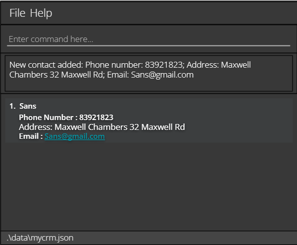

MyCRM is a **desktop application for managing client contacts, repair job statuses, and product information that has
been optimised for use via a Command Line Interface (CLI)** while maintaining the benefits of a Graphical User Interface
(GUI). If you type quickly, MyCRM can complete customer relationship management tasks faster than traditional GUI
applications.

* Table of Contents
{:toc}

--------------------------------------------------------------------------------------------------------------------

## Quick start

1. Ensure you have Java `11` or above installed in your Computer.

2. Download the latest `MyCRM.jar` from [here](https://github.com/AY2122S1-CS2103-T14-3/tp/releases).

3. Copy the file to the folder you want to use as the _home folder_ for your AddressBook.

4. Double-click the file to start the app. The GUI similar to the below should appear in a few seconds. Note how the
   app contains some sample data. 
   

5. Type the command in the command box and press Enter to execute it. 
   Some example commands you can try:

   * **`listContacts `** : Lists all contacts.

   * **`addContact `**`n/John Doe p/98765432 e/johnd@example.com a/John street, block 123, #01-01` : Adds a contact
     named `John Doe` to the MyCRM Book.

   * **`deleteContact `**`3` : Deletes the 3rd contact shown in the current list.

   * **`clear`** : Deletes all contacts.

   * **`exit`** : Exits the app.

6. Refer to the [Features](#features) below for details of each command.

--------------------------------------------------------------------------------------------------------------------

## Features

**:information_source: Notes about the command format:** 

* Words in `UPPER_CASE` are the parameters to be supplied by the user. 
  e.g. in `add n/NAME`, `NAME` is a parameter which can be used as `add n/John Doe`.

* Items in square brackets are optional. 
  e.g `n/NAME [t/TAG]` can be used as `n/John Doe t/friend` or as `n/John Doe`.

* Items with `…`​ after them can be used multiple times including zero times. 
  e.g. `[t/TAG]…​` can be used as ` ` (i.e. 0 times), `t/friend`, `t/friend t/family` etc.

* Parameters can be in any order. 
  e.g. if the command specifies `n/NAME p/PHONE_NUMBER`, `p/PHONE_NUMBER n/NAME` is also acceptable.

* If a parameter is expected only once in the command but you specified it multiple times, only the last occurrence
  of the parameter will be taken. 
  e.g. if you specify `p/12341234 p/56785678`, only `p/56785678` will be taken.

* Extraneous parameters for commands that do not take in parameters (such as `listJobs`, `listProducts `, and `exit`
  ) will be ignored. 
  e.g. if the command specifies `listJobs 123`, it will be interpreted as `listJobs`.

### Adding a job: `addJob`

### Listing all jobs: `listJob`

### Deleting a job: `deleteJob`

### Adding a contact: `addContact`

Add a new contact info of a client into the CRM.

Format: `addContact n/CLIENT_NAME n/CONTACT_NUMBER a/ADDRESS e/EMAIL`

* Creates a new contact info of a client
* In the case there happen to be multiple clients with the same name, a list of client names will be shown for the user to select from.
* Contact number, Address, Email are optional, but must have one of them to make it realistic to get access to the client.

Examples:

* `addContact n/Frisk n/93487234 a/Laptop Factory Outlet Bugis Junction e/Frisk@gmail.com`
* `addContact n/Sans n/83921823 a/Maxwell Chambers 32 Maxwell Rd e/Sans@gmail.com`

 

### Listing all contacts: `listContact`

Show a list of all contact info in the CRM.

Format:  `listContact` 

### Deleting a contact: `deleteContact`

Deletes the specified contact from the CRM

Format: deleteContact 4

* Deletes the contact at the specified `INDEX`
* `INDEX` refers to the index of the contact as shown in the contact listing
* `INDEX` must be a positive integer(1,2,3…)

### Adding a product: `addProduct`

### Listing all products: `listProduct`

### Deleting a product: `deleteProduct`

### Send mail: `mail`

Constructs an email to send to a customer of a specified job.

Format: `mail j/JOB_INDEX t/TEMPLATE_INDEX`

* Constructs a new email with template content and contact details of the job at the specified `JOB_INDEX` and
  `TEMPLATE_INDEX`.
* `JOB_INDEX` refers to the index of the job shown in the repair job listing.
* `JOB_INDEX` must be a positive integer (1,2,3…).
* `TEMPLATE_INDEX` refers to the index of the template as shown in the template listing.
* `TEMPLATE_INDEX` must be a positive integer (1,2,3…).

Examples:

* `listJobs` and `listTemplates` followed by` mail j/2 t/2` constructs an email to the 2nd job’s customer with the 2nd
  email template

    

### Adding mail template: `addTemplate`

Adds a new email template to the CRM.

Format: `addTemplate s/SUBJECT b/BODY`

Examples:

* `addTemplate s/Repair Completed b/Your product has been completely repaired.`
* `addTemplate s/Repair Issue b/Your product has faced an issue which requires your attention.`

    

### Listing all templates: `listTemplate`

Shows a list of all templates in the CRM.

Format: `listTemplates`

### Deleting mail template: `deleteTemplate`

Deletes the specified template from the CRM.

Format: `deleteTemplate INDEX`

Deletes the template at the specified `INDEX`
* `INDEX` refers to the index of the template as shown in the template listing.
* `INDEX` must be a positive integer(1,2,3…).

Examples:
* listTemplate followed by deleteTemplate 2 deletes the 2nd email template in the CRM.

### Retrieve previous command

### Viewing user guide: `help`

Shows a message explaining how to access the help page.

Format: `help`

### Exiting the program : `exit`

End MyCRM and exit the programme.

Format: `exit`

### Loading JSON data: `[coming in v1.3]`

_Details coming soon ..._

### Purging JSON data: `[coming in v1.3]`

_Details coming soon ..._

### Pinning Jobs `[coming in v1.3]`

_Details coming soon ..._

### Customising User Interfaces `[coming in v1.3]`

_Details coming soon ..._

### Hiding Contacts `[coming in v1.3]`

_Details coming soon ..._

### Hiding Jobs `[coming in v1.3]`

_Details coming soon ..._

--------------------------------------------------------------------------------------------------------------------

## FAQ

**Q**: How do I transfer my data to another Computer? 
**A**: Install the app in the other computer and overwrite the empty data file it creates with the file that
contains the data of your previous MyCRM home folder.

--------------------------------------------------------------------------------------------------------------------

## Command summary

Action              | Format, Examples
--------------------|------------------
**Add Job**         |
**List Job**        |
**Delete Job**      |
**Add Contact**     |
**List Contact**    |
**Delete Contact**  |
**Add Product**     |
**List Product**    |
**Delete Product**  |
**Mail**            | `mail JOB_INDEX TEMPLATE_INDEX` e.g., `mail 3 1`
**Add Template**    | `addTemplate s/SUBJECT b/BODY` e.g., `addTemplate s/Repair In Progress d/Your product is current;y being repaired`
**List Templates**  | `listTemplates`
**Delete Template** | `deleteTemplate INDEX` e.g., `delete 4`
**Exit**            | `exit`
