MyCRM is a **desktop application for managing client contacts, repair job statuses, and product information that has
been optimised for use via a Command Line Interface (CLI)** while maintaining the benefits of a Graphical User Interface
(GUI). If you type quickly, MyCRM can complete customer relationship management tasks faster than traditional GUI
applications.

**Target Audience:** Tech savvy computer repair shop technician. Owns a business repairing computers and laptops, 
actively servicing multiple clients and answering their queries. Services a wide range of models and deals with both 
hardware and software issues. Also has multiple repair-phases which have to be updated to clients.  

* Table of Contents
{:toc}

--------------------------------------------------------------------------------------------------------------------

## Quick start

1. Ensure you have Java `11` or above installed in your Computer.

2. Download the latest `MyCRM.jar` from [here](https://github.com/AY2122S1-CS2103-T14-3/tp/releases).

3. Copy the file to the folder you want to use as the _home folder_ for your AddressBook.

4. Double-click the file to start the app. The GUI similar to the below should appear in a few seconds. Note how the
   app contains some sample data. 
   

5. Type the command in the command box and press Enter to execute it. 
   Some example commands you can try:

   * **`listContact `** : Lists all contacts.

   * **`addContact `**`n/John Doe c/98765432 e/johnd@example.com a/John street, block 123, #01-01` : Adds a contact
     named `John Doe` to the CRM.

   * **`deleteContact `**`1` : Deletes the 1st contact shown in the current list.

   * **`clear`** : Deletes all contacts, jobs and products in MyCRM.

   * **`exit`** : Exits the app.

6. Refer to the [Features](#features) below for details of each command.

--------------------------------------------------------------------------------------------------------------------

## Features

**:information_source: Notes about the command format:** 

* Words in `UPPER_CASE` are the parameters to be supplied by the user. 
  e.g. in `add n/NAME`, `NAME` is a parameter which can be used as `add n/John Doe`.

* Items in square brackets are optional. 
  e.g `n/NAME [t/TAG]` can be used as `n/John Doe t/friend` or as `n/John Doe`.

* Items with `…`​ after them can be used multiple times including zero times. 
  e.g. `[t/TAG]…​` can be used as ` ` (i.e. 0 times), `t/friend`, `t/friend t/family` etc.

* Parameters can be in any order. 
  e.g. if the command specifies `n/NAME c/PHONE_NUMBER`, `c/PHONE_NUMBER n/NAME` is also acceptable.

* If a parameter is expected only once in the command but you specified it multiple times, only the last occurrence
  of the parameter will be taken. 
  e.g. if you specify `c/12341234 c/56785678`, only `c/56785678` will be taken.

* Extraneous parameters for commands that do not take in parameters (such as `listJob`, `listProduct`, and `exit`
  ) will be ignored. 
  e.g. if the command specifies `listJob 123`, it will be interpreted as `listJob`.

### Adding a job: `addJob`

Adds a new repair job to the CRM.

Format: `addJob d/DESCRIPTION by/EXPECTED_COMPLETION_DATE fee/FEE [recv/RECIEVED_DATE] [c/CONTACT_INDEX] [p/PRODUCT_INDEX]`
Format of special subcommands: `select INDEX` and `abort` (details on subcommand usage below)

* Creates a new repair job.
* Links the contact and product that correspond to `CONTACT_INDEX` and `PRODUCT_INDEX` (in the respective contact 
  and product list) to the job.
* `EXPECTED_COMPLETION_DATE` refers to the date by which the repair expected to be completed.
* `FEE` refers to the repair fee charged to the client.
* `RECIEVED_DATE` refers to the date the repair job request was received from the client. If not provided, it is by default,
  set to the date the job is created in MyCRM.
* Both product and contact are compulsory attributes of job. If they are not provided 
  in the form of an index in the above command, the job is not immediately added.
  * Instead, in such a case, the user will be asked for info on the missing contact or product (or both).
  * User can choose to create a new contact/product and immediately assign it to the job currently being created 
    via the `addContact` and `addProduct` commands.
  * Or the user can issue a command `select INDEX` to select an item from its displayed list.
  * While the user is being asked for a contact/product only selected commands will be allowed
    (namely the list, find and add commands for either product or contact).
  * The user can choose to stop this operation and not add any new job by issuing a `abort` command.
  * Note: The user is asked for the contact and product one after the other. i.e If asked for the contact first
    user cannot select or create a product instead.
  * Note: If the operation is stopped via the `abort` command, the job will not be added but any new products/contacts
    created through the `addContact` and `addProduct` commands will still be added.

Examples:

* To add a job with a pre-existing contact and product
* Either the command `addJob d/Change CPU fee/$50 by/10/11/2021 c/1 p/1` can be issued OR 
* The following sequence of commands can be issued:
  * `addJob d/Change CPU fee/$50 by/10/11/2021` 
  * `select 1` (to select contact) 
  * `select 1` (to select product)

      
  
* To add a job with a new contact and product
* Issue the following sequence of commands:
  * `addJob d/Change CPU fee/$50 by/10/11/2021` 
  * `addContact n/Jack Ryan c/94678954 a/Blk 65 Tampines Ave 1 e/jryan@gmail.com` 
  * `addProduct n/Asus DUAL-GTX1060-O6G t/GPU m/Asus d/DisplayPort, HDMI`

     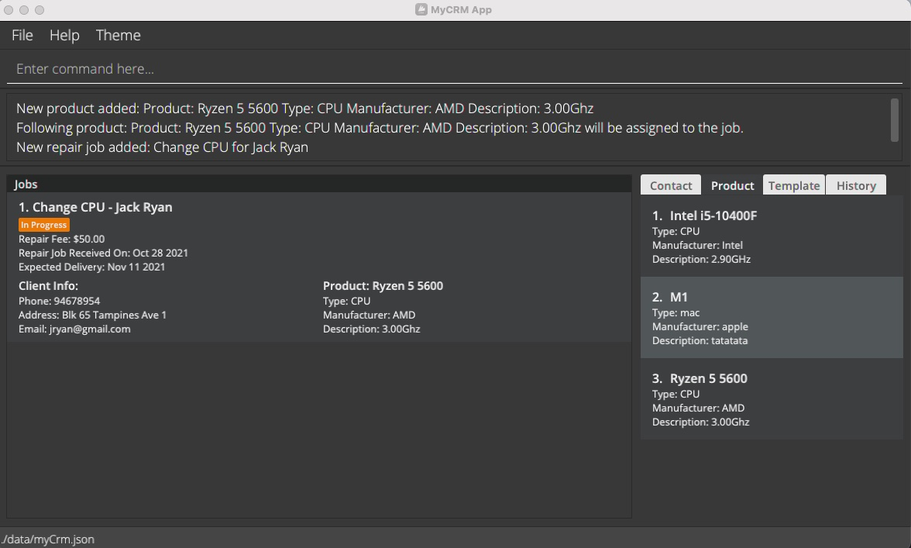

### Editing a job: `editJob`

Edits an existing repair job to the CRM.

Format: `editJob INDEX [d/DESCRIPTION] [by/EXPECTED_COMPLETION_DATE] [fee/FEE] [recv/RECIEVED_DATE] [c/CONTACT_INDEX] [p/PRODUCT_INDEX]`
Format of special subcommands: `select INDEX` and `abort` (details on subcommand usage below)

* Edits the repair job at the specified `INDEX`
* `INDEX` refers to the index of the repair job as shown in the repair job listing
* `INDEX` must be a positive integer(1,2,3…)
* It is possible to not indicate the `CONTACT_INDEX` or `PRODUCT_INDEX`. i.e A command like `editJob INDEX c/ p/` is valid.
    * In such a case the user will be asked for info which product or contact (or both) 
      they now want to assign to the job.
    * User can choose to create new contact/product and immediately assign it via 
      the `addContact` and `addProduct` commands.
    * Or the user can issue a command `select INDEX` to select an item from the displayed list.
    * While the user is being asked for a contact/product only selected commands will be allowed
      (namely the list, find and add commands for either product or contact).
    * The user can choose to stop this operation and not edit the job by issuing a `abort` command.
    * Note: The user is asked for the contact and product one after the other. i.e If asked for the contact first
      user cannot select or create a product instead.
    * Note: If the operation is stopped via the `abort` command, the job will not be edited at all.
      However, any new products/contacts created through the `addContact` and `addProduct` commands will still be added.

Examples:

* To edit a job and reassign to it other pre-existing contact and product
* Either the command `editJob 1 c/1 p/2` can be issued OR
* The following sequence of commands can be issued:
  * `editJob 1 c/ p/`
  * `select 1` (to select contact)
  * `select 2` (to select product)

      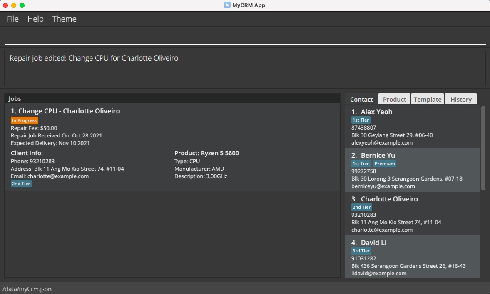

* To add a job with new a contact and product
* Issue the following sequence of commands:
  * `editJob 1 c/ p/`
  * `addContact n/James Bond c/94678007 a/Blk 61 Yishun Ave 1 e/bond@gmail.com`
  * `addProduct n/SAMSUNG 980 PRO 1TB SSD t/Hard disk m/SAMSUNG d/SATA`

     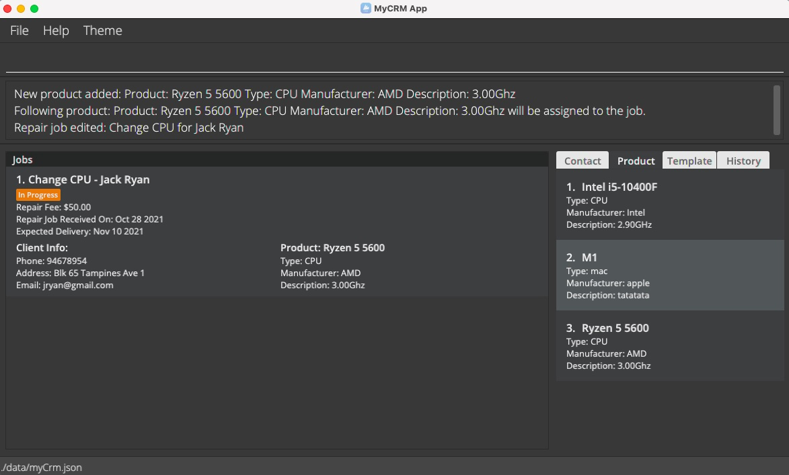
  
### Listing all jobs: `listJob`

Shows a list of all in-progress repair jobs in the CRM.

Format: `listJob [-a] [-c]`

* To show a list of all jobs, regardless of completion status the command `listJob -a` can be issued
* To show a list of all completed jobs the command `listJob -c` can be issued

Examples:

* `listJob`

  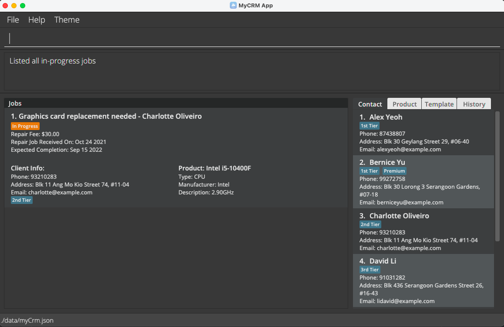

* `listJob -c`

  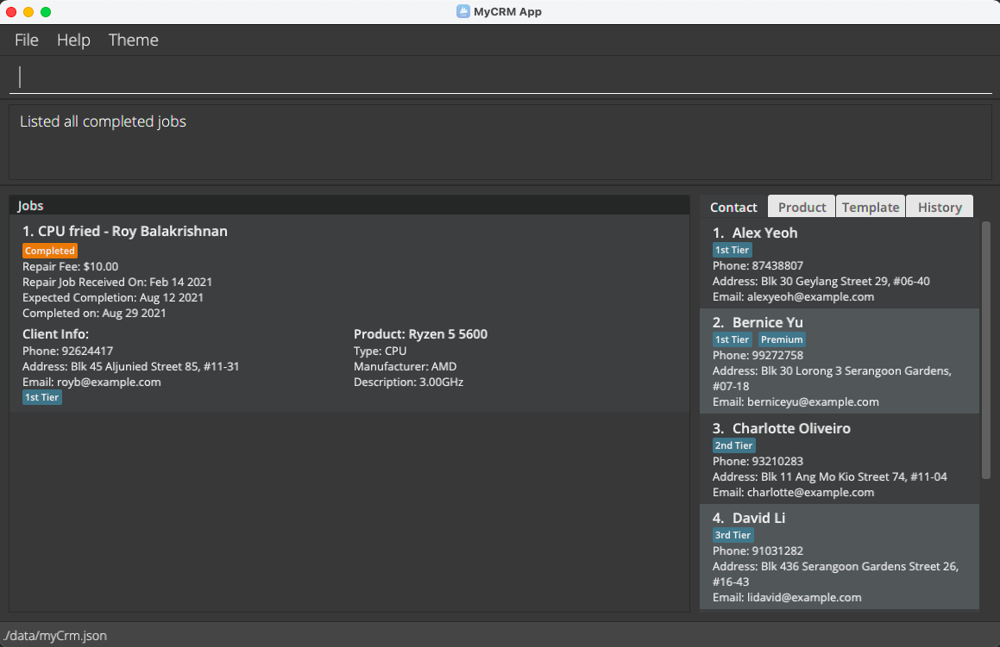

* `listJob -a`

  

### Find Job: `findJob`

Find jobs whose description, contact or product contain certain keywords.

Format: `findJob [MORE_KEYWORDS]...`

* The search is case-insensitive. e.g. `intel` will match `Intel`.
* Only full words will be matched. e.g. `Inte` will not match `Intel`.
* Jobs matching at least one keyword will be returned.

Example:

* `findJob charlotte intel`

  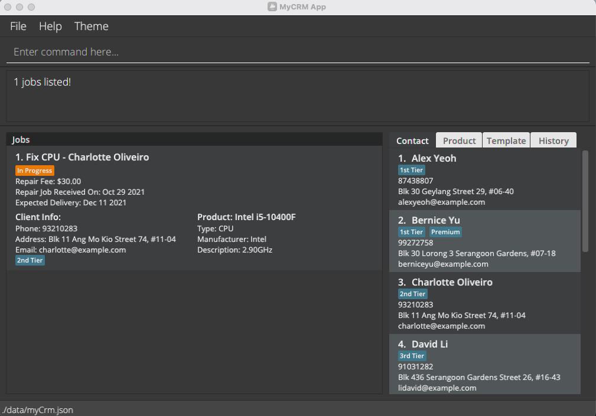

### Marking job as complete: `completeJob`

Marks a repair job as complete

Format: `completeJob INDEX [COMPLETION_DATE]`

* Marks the repair job at the specified `INDEX` as complete
* By default `listJob` only shows jobs that are yet to be completed. As such marking the job as complete will cause 
  it to disappear from the current job list. User can issue the command `listJob -c` to view the list of completed jobs.
* `INDEX` refers to the index of the repair job as shown in the repair job listing
* `INDEX` must be a positive integer(1,2,3…)
* `COMPLETION_DATE` is set to the current date if it is not provided

Example:

* Given one in-progress job

  
  
* `completeJob 1` - causes the job to disappear from the current job list

  
  
* If `listJob -c` is called, it can be seen that the job was successfully completed

  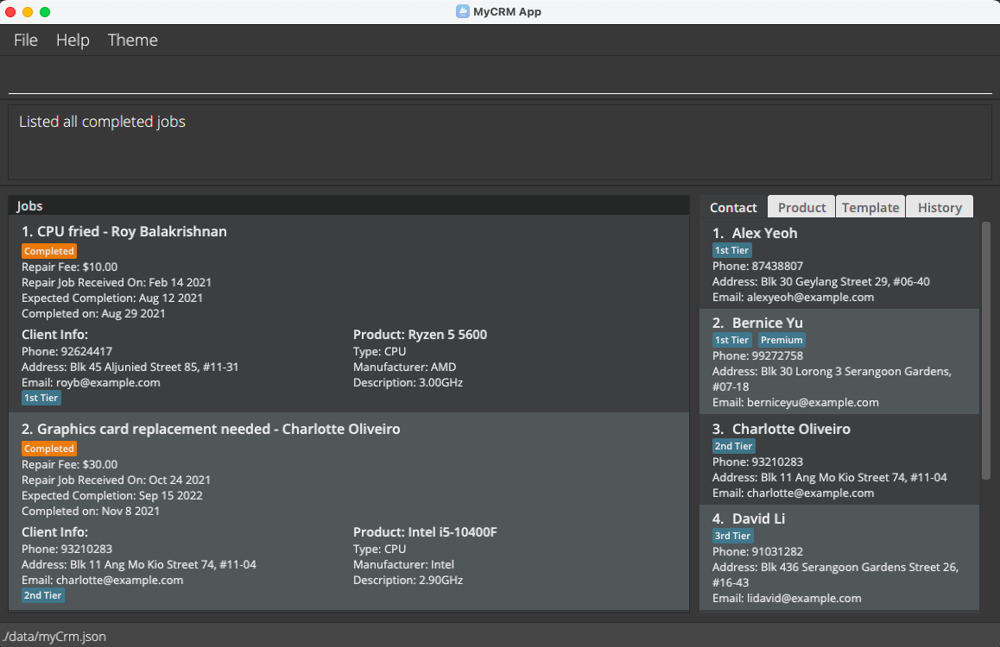

### Revert the completion status of a previously complete job: `undoCompleteJob`

Reverts the status of a previously completed job back to in-progress.

Format: `undoCompleteJob INDEX`

* Marks the repair job at the specified `INDEX` as complete
* User should call `listJob -c` to view all completed jobs before calling this command
* `INDEX` must refer to a completed job. It will not work on a currently in-progress job
* `INDEX` refers to the index of the repair job as shown in the repair job listing
* `INDEX` must be a positive integer(1,2,3…)

Example:

* Given one completed job

  

* If `undoCompleteJob 1` is called, it can be seen that the job's status was reverted to in-progress

  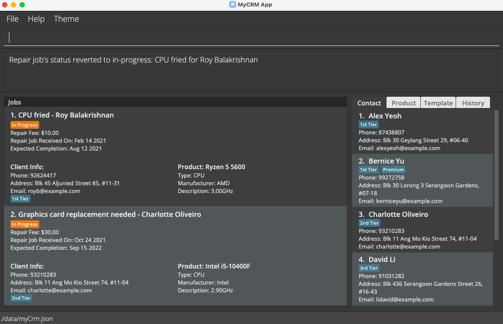

### Deleting a job: `deleteJob`

Delete the specified repair job from the CRM

Format: `deleteJob INDEX`

* Deletes the repair job at the specified `INDEX`
* `INDEX` refers to the index of the repair job as shown in the repair job listing
* `INDEX` must be a positive integer(1,2,3…)

### Adding a contact: `addContact`

Add a new contact info of a client into the CRM.

Format: `addContact n/CLIENT_NAME [c/CONTACT_NUMBER] [e/EMAIL] [a/ADDRESS] [t/tags]`

* Creates a new contact info of a client.
* At least one field of `c/CONTACT_NUMBER` `e/EMAIL` `a/ADDRESS`should exist even though they are considered optional fields.
  
  i.e. `addContact n/CLIENT_NAME` is not allowed. 
  
  `addContact n/CLIENT_NAME e/EMAIL`, `addContact n/CLIENT_NAME c/CONTACT_NUMBER` commands like these are valid.

Examples:

* `addContact n/Frisk c/93487234 e/Frisk@gmail.com a/Laptop Factory Outlet Bugis Junction`
* `addContact n/Sans c/83921823 e/Sans@gmail.com a/Maxwell Chambers 32 Maxwell Rd`
  
  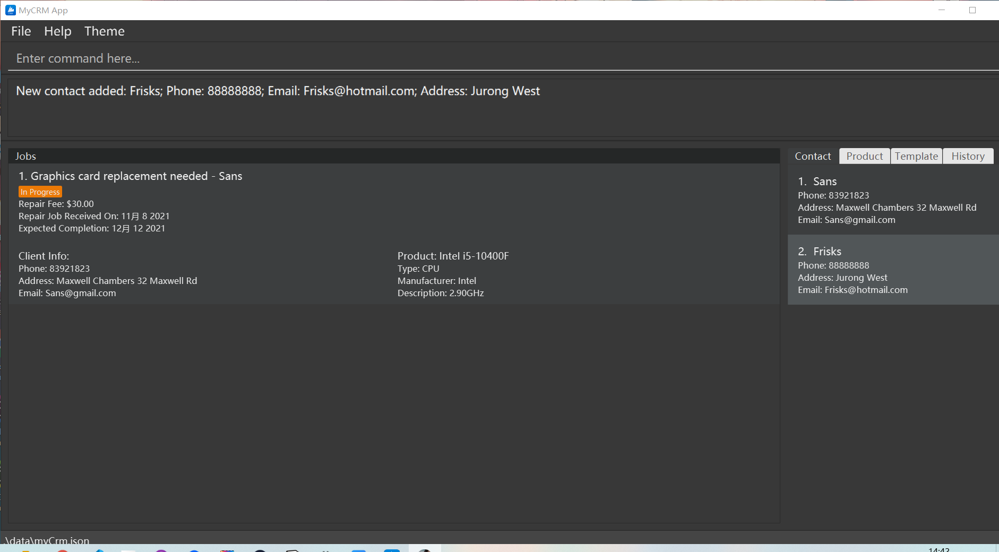

### Deleting a contact: `deleteContact`

Deletes the specified contact from the CRM

Format: `deleteContact INDEX`

* Deletes the contact at the specified `INDEX`
* `INDEX` refers to the index of the contact as shown in the contact listing
* `INDEX` must be a positive integer(1,2,3…)
* If this contact is link to a job, it can not be deleted unless the linked job is deleted.

Example:

`deleteContact 3`

  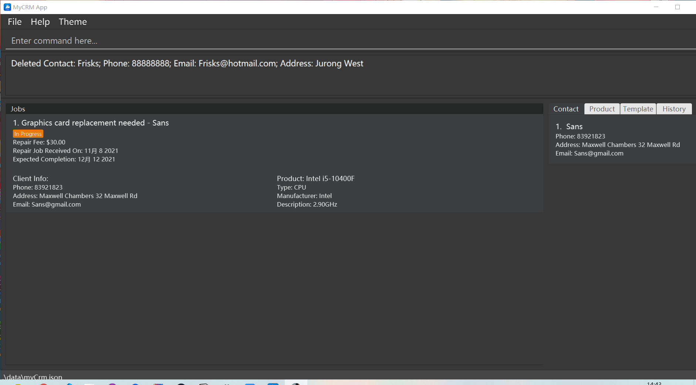

### Editing a contact: `editContact`

Edits the specified contact from the CRM

Format: `editContact INDEX [n/NAME] [c/PHONE] [e/EMAIL] [a/ADDRESS]`

* At least one field of name, phone, email or address has to provide in order to
  change a contact's info.
* After invoking `editContact ...` command, the job linked to this contact will also
  update.

Example: 

`editContact 1 a/Jurong West Street 42` 

  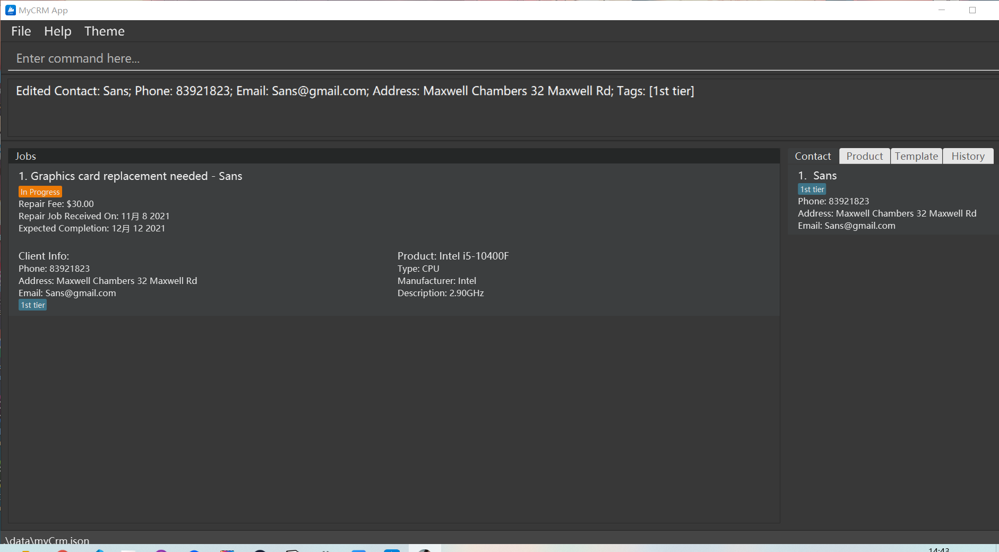

### Finding a contact: `findContact `

Find certain contact with keyword specified.

Format: `findContact [MORE_KEYWORDS]... `

* User must provide at least one keyword of a contact.

Example:

`findContact Frisk Sans`

  

### Hiding a contact: `hideContact`

Hide certain contact with INDEX specified.

Format: `hideContact INDEX`

* `hideContact` will add a tag `hidden` to those being hidden.
* Cannot invoke `hideContact` **again** to those being hidden.
* Contacts hidden does not display in MyCRM unless `listContact -a` is invoked.
* So far hiding a specific contact will not affect job card.

Example:

`hideContact 1`

  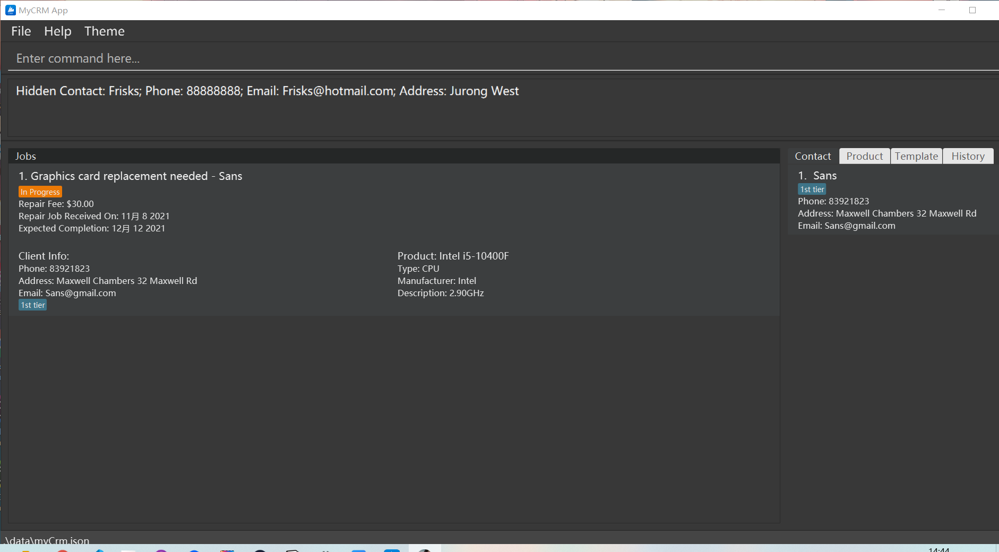

### Undoing hiding a contact: `undoHideContact`

Undo a previous `hideContact` command to certain contact with INDEX specified.

Format: `undoHideContact INDEX`

* `listContact -a` must be called in order to see hidden contacts.
* `undoHideContact` will delete `hidden` tag to the hidden contact.
* Cannot invoke `undoHideContact` to visible contacts.

Example:

`undoHideContact 1`

  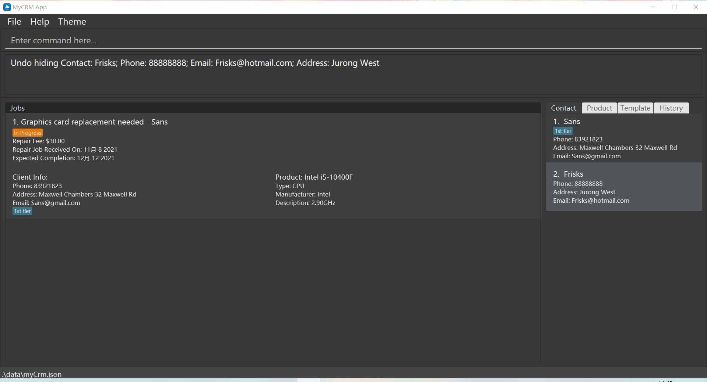

### Listing all contacts: `listContact`

Show a list of all contact info in the CRM.

Format: `listContact` or `listContact -a`

* Normally, `listContact` will only list contacts not being hidden.
* If `listContact -a` is invoked, all contacts including hidden ones will be listed.

Examples:

* `listContact`

  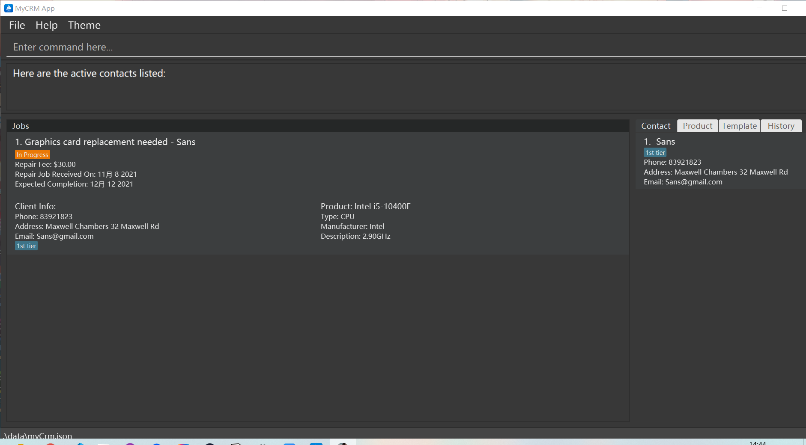

* `listContact -a`

  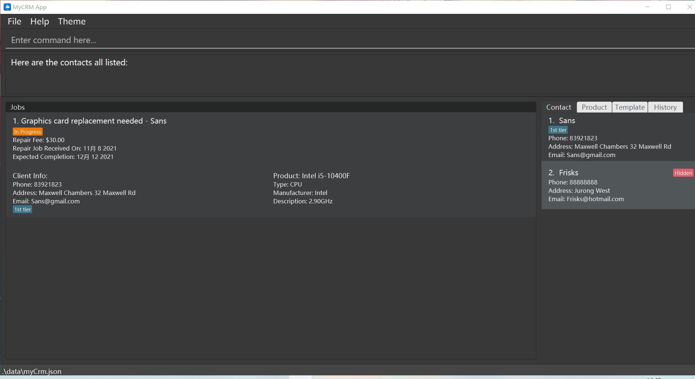

### Adding a product: `addProduct`

Adds a new product to the CRM.

Format: `addProduct n/NAME [t/TYPE] [m/MANUFACTURER] [d/DESCRIPTION]`

* `NAME` is a compulsory field. It must be non-empty.

Examples:

* `addProduct n/Asus DUAL-GTX1060-O6G t/GPU m/Asus`
* `addProduct n/Intel i5-10400F t/CPU m/Intel d/2.90GHz`

    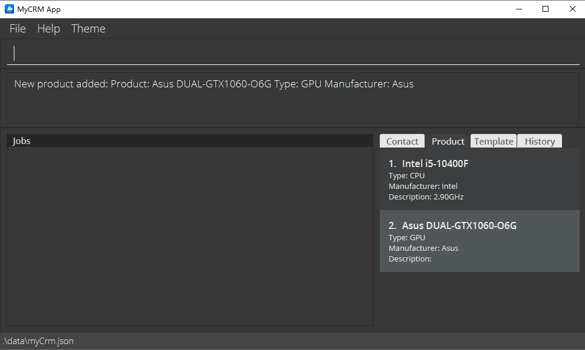

### Listing all products: `listProduct`

Shows a list of all products in the CRM.

Format: `listProduct`

### Deleting a product: `deleteProduct`

Deletes the specified product from the CRM.

Format: `deleteProduct INDEX`

* Deletes the product at the specified `INDEX`.
* `INDEX` refers to the index of the product as shown in the product listing.
* `INDEX` must be a positive integer(1,2,3…).
* A product cannot be deleted if it is linked to one or more jobs.

### Editing a product: `editProduct`

Edits an existing product in the CRM.

Format: `editProduct INDEX [n/NAME] [t/TYPE] [m/MANUFACTURER] [d/DESCRIPTION]`

* Edits the product at the specified `INDEX`. 
* The index refers to the index number shown in the displayed product list.
* `INDEX` must be a positive integer(1,2,3…).
* At least one of the optional fields must be provided. 
* No change is made if a field is empty. e.g. 
  `editProduct 1 m/Asus t/` will not change the product's `Type` field.
* Changes in product fields will be updated in job list *automatically*.

Example:

* `editProduct 3 d/Video output interface: DisplayPort, HDMI` edits the description of the 3rd product to be
  `Video output interface: DisplayPort, HDMI`.

    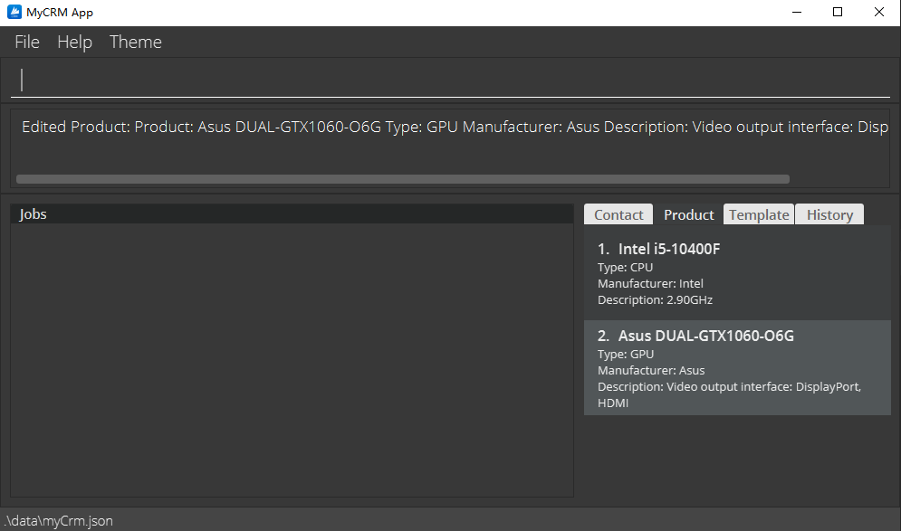

### Locating products by name: `findProduct`

Finds products whose names contain certain keywords.

Format: `findProduct [MORE_KEYWORDS]...`

* The search is case-insensitive. e.g. `asus` will match `Asus`.
* Only full words will be matched. e.g. `Asu` will not match `Asus`.
* Products matching at least one keyword will be returned.

Example:

* `findProduct asus`
  
  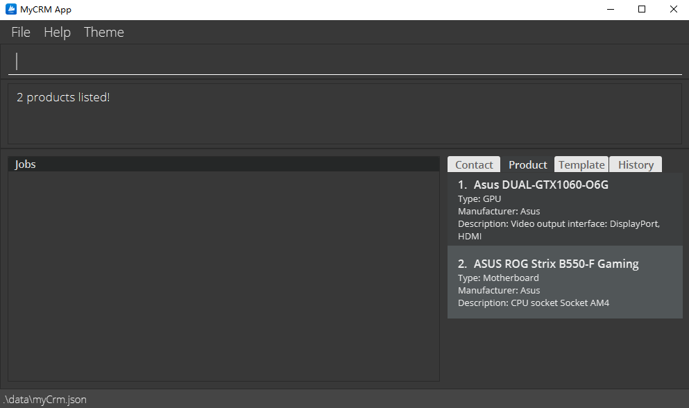

### Send mail: `mail`

Constructs an email to send to a customer of a specified job. This command also generates a `mailto:` hyperlink to 
mail the email to a customer of a specified job.

Format: `mail j/JOB_INDEX t/TEMPLATE_INDEX`

* Constructs a new email with template content and contact details of the job at the specified `JOB_INDEX` and
  `TEMPLATE_INDEX`.
* `JOB_INDEX` refers to the index of the job shown in the repair job listing.
* `JOB_INDEX` must be a positive integer (1,2,3…).
* `TEMPLATE_INDEX` refers to the index of the template as shown in the template listing.
* `TEMPLATE_INDEX` must be a positive integer (1,2,3…).
* `Job` selected must have an email address, non-empty.

Examples:

* `listJob` and `listTemplate` followed by` mail j/1 t/1` constructs an email to the 2nd job’s customer with the 2nd
  email template and `mailto:` hyperlink.

    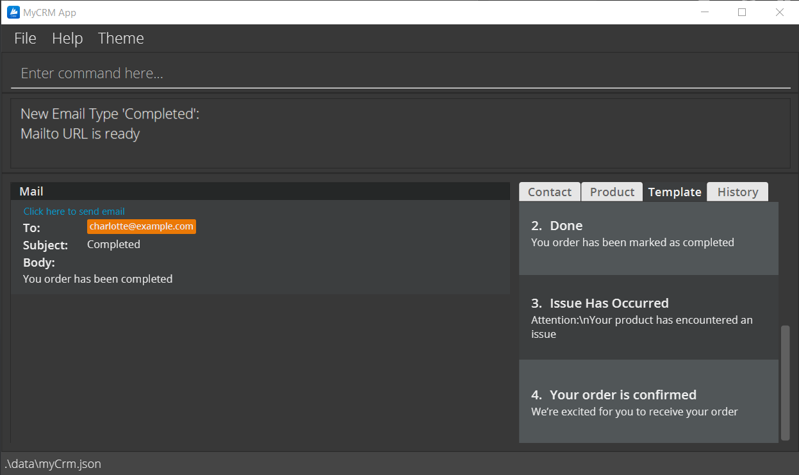
  
    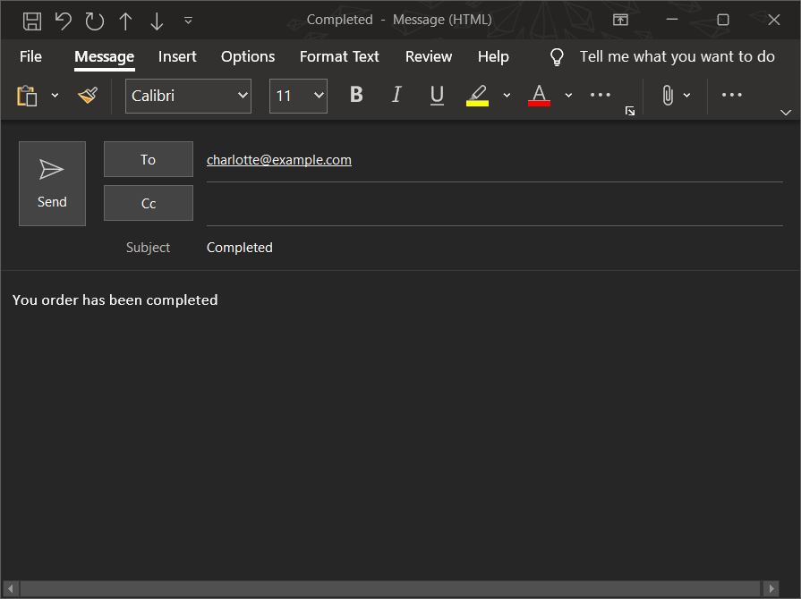

### Adding mail template: `addTemplate`

Adds a new email template into the CRM.

Format: `addTemplate s/SUBJECT b/BODY`

* `SUBJECT` and `BODY` field must be non-empty.
* `SUBJECT` only accepts alphanumeric values and spaces in between.
  * i.e. Special characters are not allowed. 
  * Such as `s/He@der 3!` are not allowed.
* `BODY` accepts any string value (alphanumeric and special characters).
* `BODY` processes special string `\n` as newline for constructing email.
  * This is only displayed on `mail` command

Examples:

* `addTemplate s/Issue Has Occurred b/Attention:\nYour product has encountered an issue` adds a new Template with 
  subject "Issue Has Occurred" and body "Attention:\nYour product has encountered an issue". 
* `addTemplate s/Your order is confirmed b/Your order is confirmed! Thank you for ordering from XXX` adds a new 
  Template with subject "our order is confirmed" and body "Your order is confirmed! Thank you for ordering from XXX".

    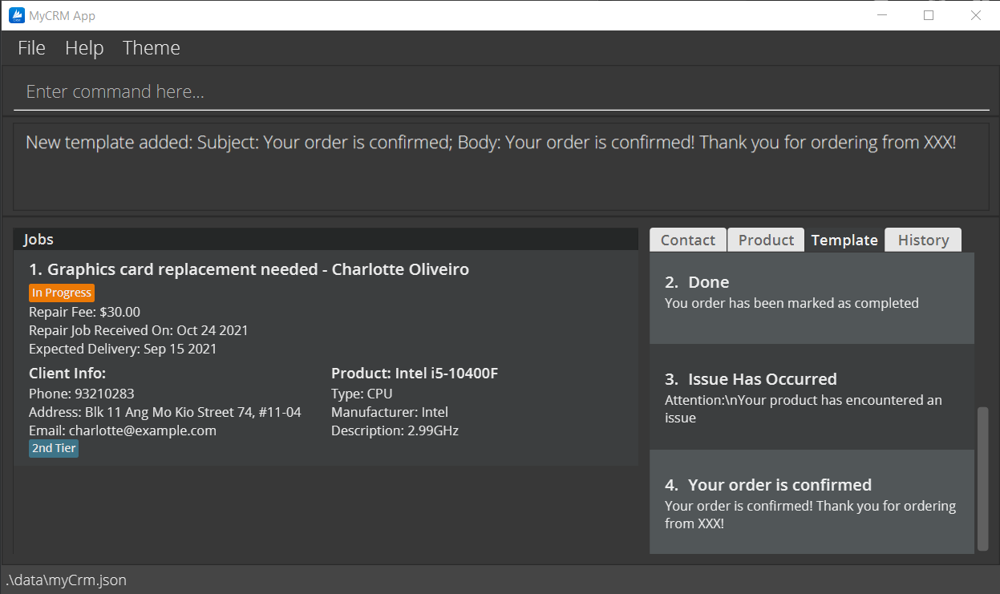

### Listing all templates: `listTemplate`

Shows a list of all templates in the CRM.

Format: `listTemplate`

  

### Editing mail template: `editTemplate`

Edits the specified template from the CRM.

Format: `editTemplate INDEX [s/SUBJECT] [b/BODY]`

* At least one optional edit field must be provided
* `SUBJECT` only accepts alphanumeric values and spaces in between.
* `BODY` accepts any string value (alphanumeric and special characters).

Edits the template at the specified `INDEX`

* `INDEX` refers to the index of the template as shown in the template listing
* `INDEX` must be a positive integer(1,2,3…).

Examples:

* `listTemplate` followed by `editTemplate 4 b/We’re excited for you to receive your order` edits the 4th email
  template in the CRM, overriding the 4th email template's body with the new input.

    

### Finding mail template: `findTemplate`

Find certain template(s) with keyword specified.

Format: `findTemplate [MORE_KEYWORDS]... `

* User must provide at least one keyword of a template.
* `MORE_KEYWORDS` searches for `Subject` title
* `MORE_KEYWORDS` are case-insensitive
* `MORE_KEYWORDS` searched are whole words

Example:

* `findTemplate Order`

    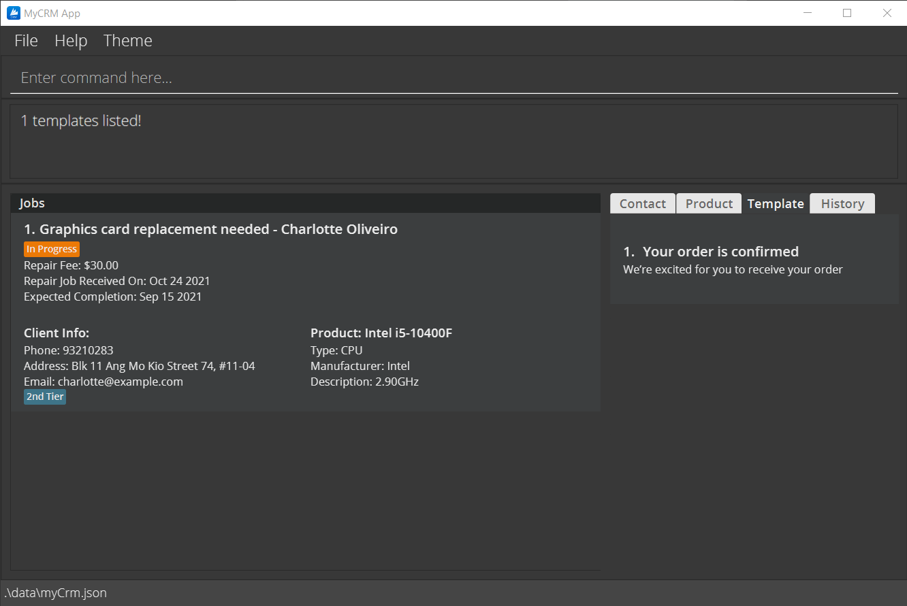

### Deleting mail template: `deleteTemplate`

Deletes the specified template from the CRM.

Format: `deleteTemplate INDEX`

Deletes the template at the specified `INDEX`
* `INDEX` refers to the index of the template as shown in the template listing.
* `INDEX` must be a positive integer(1,2,3…).

Examples:

* `listTemplate` followed by `deleteTemplate 4` deletes the 4th email template in the CRM.

    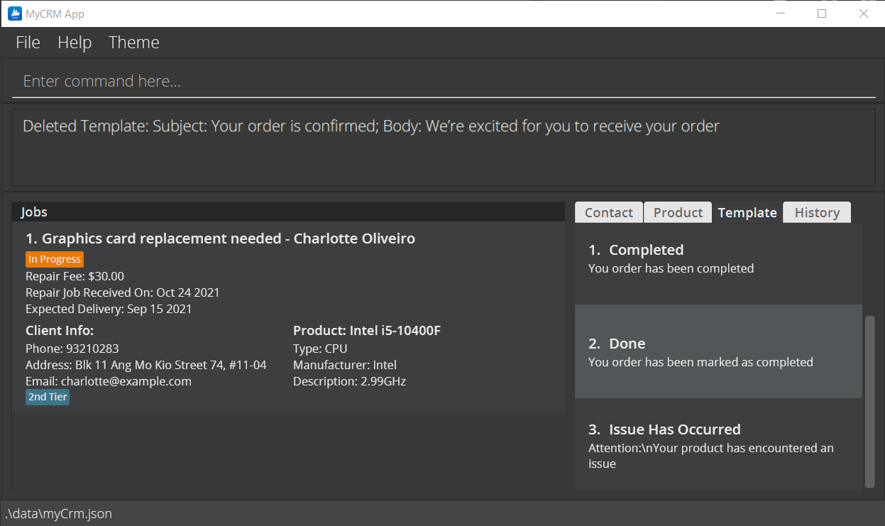

### Retrieve previous command: `history`

Retrieves the previously entered command

Format: Press "Up arrow key" / `history`

* ‘Press Up arrow key’ on the keyboard to gain the most recent command in the CRM.
* `history` will list all history commands in the CRM

Examples:

* `history`(Assume that `listJob` and  `listContact` have been entered before running  `history`): 

    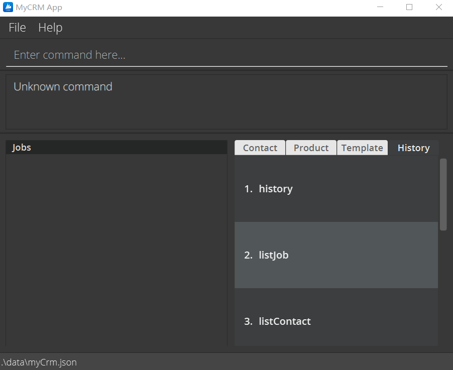
    
### Clear history command data: `clearHistory`

Clears all historical data of user input

Format:  `clearHistory`

### Viewing user guide: `help`

Shows a message explaining how to access the help page and a hyperlink to it.

Format: `help`

  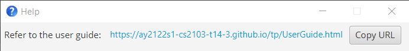

### Exiting the program : `exit`

Ends MyCRM and exits the programme.

Format: `exit`

### Clearing data: `clear`

Clears current data in the CRM. Empties CRM data.

Format: `clear`

  

### Changing the theme of user interface `theme`

Changes the theme of user interface.

Format: `theme THEME_NAME`

* There are 2 available Ui themes of the CRM. Their names are `dark` and `light`.
* `THEME_NAME` is case-insensitive.

Example: `theme light`

  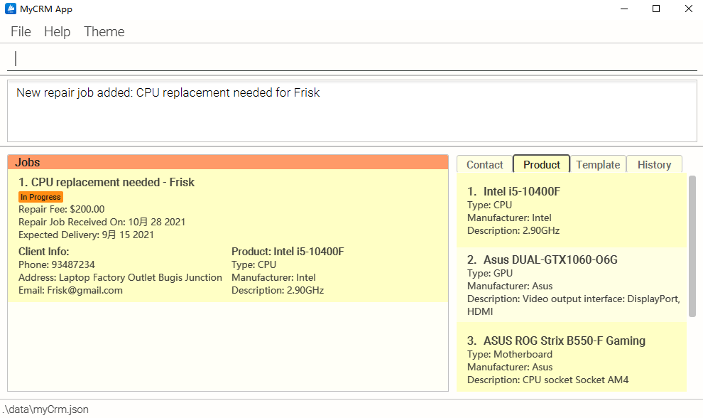

### Printing monthly report `printReport`

Prints a report of all jobs within current month.

Format: `printReport [-i] [-p]`

* To show a report window with monthly in-progress jobs list, the command `printReport -i` can be issued
* To show a report window with monthly top-three products list, the command `printReport -p` can be issued
* MyCRM will show a report window with monthly completed job list by default
  
  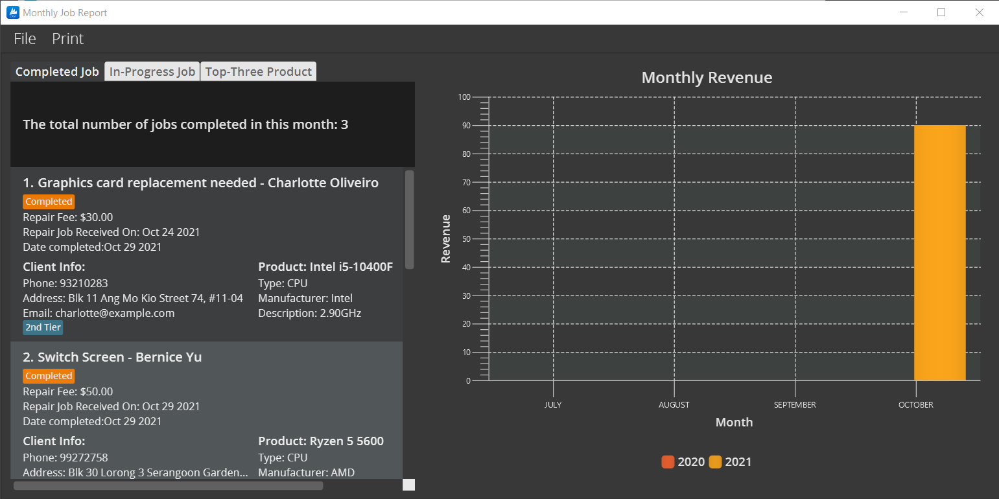

### Export monthly report

Exports a report of all jobs within current month to printer.

Format: Click on "Print" / `exportReport`

  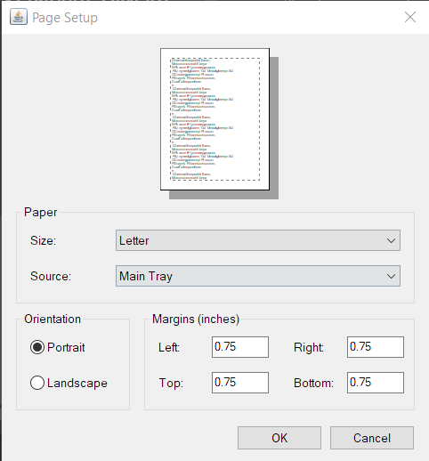

  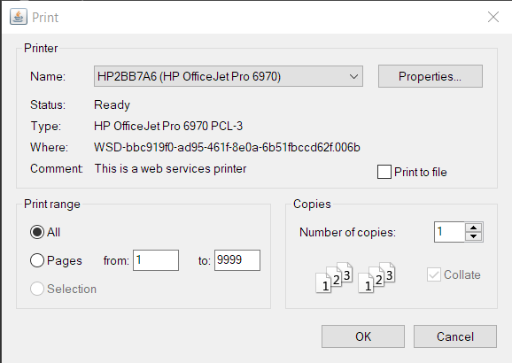
  (for Windows OS)
    
  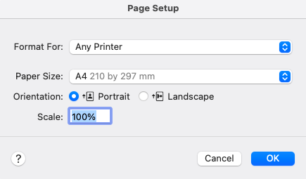
  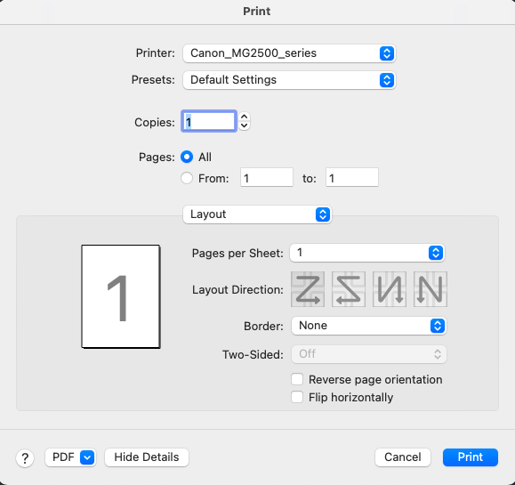
  (for Mac OS)

--------------------------------------------------------------------------------------------------------------------

## FAQ

**Q**: How do I transfer my data to another Computer? 
**A**: Install the app in the other computer and overwrite the empty data file it creates with the file that
contains the data of your previous MyCRM home folder.

--------------------------------------------------------------------------------------------------------------------

## Command summary

Action              | Format, Examples
--------------------|------------------
**Add Job**         | `addJob d/DESCRIPTION by/EXPECTED_COMPLETION_DATE fee/FEE [recv/RECIEVED_DATE] [c/CONTACT_INDEX] [p/PRODUCT_INDEX]`  e.g.,`addJob d/CPU replacement needed c/1 p/1 by/15/09/2021 fee/30.00`
**Edit Job**        | `editJob INDEX [d/DESCRIPTION] [by/EXPECTED_COMPLETION_DATE] [fee/FEE] [recv/RECIEVED_DATE] [c/CONTACT_INDEX] [p/PRODUCT_INDEX]`  e.g., `editJob 1 fee/50.00 c/2 p/3`
**List Job**        | `listJob`
**Find Job**        | `findJob [MORE_KEYWORDS]... `   e.g., `findJob charlotte intel`
**Complete Job**    | `completeJob INDEX [COMPLETION_DATE]`  e.g., `completeJob 1`
**Undo Complete Job** | `undoCompleteJob INDEX`  e.g., `undoCompleteJob 1`
**Delete Job**      | `deleteJob INDEX`  e.g., `deleteJob 2`
**Select**          | `select INDEX`   e.g.,`select 1`
**Abort**           |  `abort` 
**Add Contact**     | `addContact n/CLIENT_NAME [c/CONTACT_NUMBER] [e/EMAIL] [a/ADDRESS] [t/tag]`  e.g., `addContact n/Frisk c/93487234 e/Frisk@gmail.com a/Laptop Factory Outlet Bugis Junction`
**Edit Contact**     |`editContact INDEX [n/NAME] [c/PHONE] [e/EMAIL] [a/ADDRESS] `  e.g., `EditContact 1 n/Dante`
**List Contact**    | `listContact` `listContact -a`
**Find Contact**     |`findContact [MORE_KEYWORDS]... `  e.g., `findContact Sans`
**Hide Contact**     |`hideContact INDEX `  e.g., `hideContact 1`
**Undo Hide Contact**     |`undoHideContact INDEX... `  e.g., `undoHideContact 1`
**Delete Contact**  | `deleteContact INDEX`  e.g., `deleteContact 4`
**Add Product**     | `addProduct n/NAME [t/TYPE] [m/MANUFACTURER] [d/DESCRIPTION]` e.g., `addProduct n/Asus DUAL-GTX1060-O6G t/GPU m/Asus`
**List Product**    | `listProduct`
**Delete Product**  | `deleteProduct INDEX` e.g., `deleteProduct 4`
**Edit Product**  | `editProduct INDEX [n/NAME] [t/TYPE] [m/MANUFACTURER] [d/DESCRIPTION]` e.g., `editProduct 2 d/Video output interface: DisplayPort, HDMI`
**Find Product**  | `findProduct [MORE_KEYWORDS]...` e.g., `findProduct asus`
**Mail**            | `mail j/JOB_INDEX t/TEMPLATE_INDEX` e.g., `mail j/3 t/1`
**Add Template**    | `addTemplate s/SUBJECT b/BODY` e.g., `addTemplate s/Repair In Progress b/Your product is current;y being repaired`
**List Templates**  | `listTemplate`
**Find Templates**     |`findTemplate [MORE_KEYWORDS]... `  e.g., `findTemplates complete`
**Edit Templates**  | `editTemplate INDEX [s/SUBJECT] [b/SUBJECT]`  e.g., `editTemplate 2 s/Your immediate attention`
**Delete Template** | `deleteTemplate INDEX` e.g., `deleteTemplate 4`
**Retrieve Previous Command** | `history`, "Press Up arrow key"
**Exit**            | `exit`
**Change Theme**    | `theme THEME_NAME` e.g., `theme light`
**Print Monthly Report**    | `printReport`
**Export Monthly Report**    | `exportReport`
