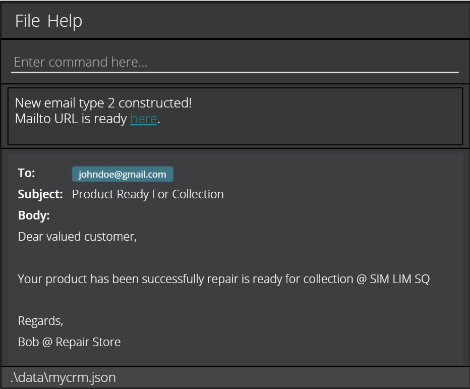
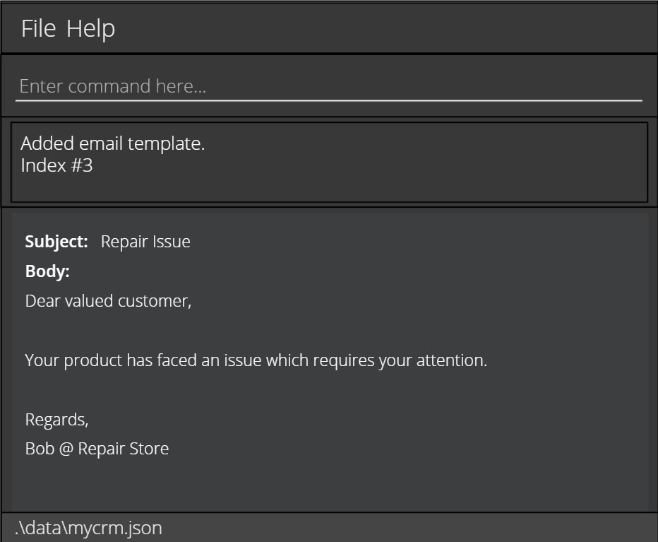

# User Guide

MyCRM is a **desktop application for managing client contacts, repair job statuses, and product information that has
been optimised for use via a Command Line Interface (CLI)** while maintaining the benefits of a Graphical User Interface
(GUI). If you type quickly, MyCRM can complete customer relationship management tasks faster than traditional GUI
applications.

* Quick start
* Features
  * Adding a job: `addJob`
  * Listing all jobs: `listJob`
  * Deleting a job: `deleteJob`
  * Adding a contact: `addContact`
  * Listing all contacts: `listContact`
  * Deleting a contact: `deleteContact`
  * Adding a product: `addProduct`
  * Listing all products: `listProduct`
  * Deleting a product: `deleteProduct`
  * Send mail: `mail`
  * Adding mail template: `addTemplate`
  * Listing all templates: `listTemplate`
  * Deleting mail template: `deleteTemplate`
  * Retrieve previous command
  * Exiting the program : `exit`
  * Pinning Jobs `[coming in v1.3]`
  * Customising User Interfaces `[coming in v1.3]`
  * Hiding Contacts `[coming in v1.3]`
  * Hiding Jobs `[coming in v1.3]`
* Command summary

--------------------------------------------------------------------------------------------------------------------

## Quick start

1. Ensure you have Java `11` or above installed in your Computer.

2. Download the latest `MyCRM.jar` from [here](https://github.com/AY2122S1-CS2103-T14-3/tp/releases).

3. Copy the file to the folder you want to use as the _home folder_ for your AddressBook.

4. Double-click the file to start the app. The GUI similar to the below should appear in a few seconds. Note how the
   app contains some sample data. 
   

5. Type the command in the command box and press Enter to execute it. 
   Some example commands you can try:

   * **`listContacts `** : Lists all contacts.

   * **`addContact `**`n/John Doe p/98765432 e/johnd@example.com a/John street, block 123, #01-01` : Adds a contact
     named `John Doe` to the MyCRM Book.

   * **`deleteContact `**`3` : Deletes the 3rd contact shown in the current list.

   * **`clear`** : Deletes all contacts.

   * **`exit`** : Exits the app.

6. Refer to the [Features](#features) below for details of each command.

--------------------------------------------------------------------------------------------------------------------

## Features

**:information_source: Notes about the command format:** 

* Words in `UPPER_CASE` are the parameters to be supplied by the user. 
  e.g. in `add n/NAME`, `NAME` is a parameter which can be used as `add n/John Doe`.

* Items in square brackets are optional. 
  e.g `n/NAME [t/TAG]` can be used as `n/John Doe t/friend` or as `n/John Doe`.

* Items with `…`​ after them can be used multiple times including zero times. 
  e.g. `[t/TAG]…​` can be used as ` ` (i.e. 0 times), `t/friend`, `t/friend t/family` etc.

* Parameters can be in any order. 
  e.g. if the command specifies `n/NAME p/PHONE_NUMBER`, `p/PHONE_NUMBER n/NAME` is also acceptable.

* If a parameter is expected only once in the command but you specified it multiple times, only the last occurrence
  of the parameter will be taken. 
  e.g. if you specify `p/12341234 p/56785678`, only `p/56785678` will be taken.

* Extraneous parameters for commands that do not take in parameters (such as `listJobs`, `listProducts `, and `exit`
  ) will be ignored. 
  e.g. if the command specifies `listJobs 123`, it will be interpreted as `listJobs`.

### Adding a job: `addJob`

### Listing all jobs: `listJob`

### Deleting a job: `deleteJob`

### Adding a contact: `addContact`

### Listing all contacts: `listContact`

### Deleting a contact: `deleteContact`

### Adding a product: `addProduct`

### Listing all products: `listProduct`

### Deleting a product: `deleteProduct`

### Send mail: `mail`

Constructs an email to send to a customer of a specified job.

Format: `mail j/JOB_INDEX t/TEMPLATE_INDEX`

* Constructs a new email with template content and contact details of the job at the specified `JOB_INDEX` and
  `TEMPLATE_INDEX`.
* `JOB_INDEX` refers to the index of the job shown in the repair job listing.
* `JOB_INDEX` must be a positive integer (1,2,3…).
* `TEMPLATE_INDEX` refers to the index of the template as shown in the template listing.
* `TEMPLATE_INDEX` must be a positive integer (1,2,3…).

Examples:

* `listJobs` and `listTemplates` followed by` mail j/2 t/2` constructs an email to the 2nd job’s customer with the 2nd
  email template

    

### Adding mail template: `addTemplate`

Adds a new email template to the CRM.

Format: `addTemplate s/SUBJECT b/BODY`

Examples:

* `addTemplate s/Repair Completed b/Your product has been completely repaired.`
* `addTemplate s/Repair Issue b/Your product has faced an issue which requires your attention.`

    

### Listing all templates: `listTemplate`

Shows a list of all templates in the CRM.

Format: `listTemplates`

### Deleting mail template: `deleteTemplate`

Deletes the specified template from the CRM.

Format: `deleteTemplate INDEX`

Deletes the template at the specified `INDEX`
* `INDEX` refers to the index of the template as shown in the template listing.
* `INDEX` must be a positive integer(1,2,3…).

Examples:
* listTemplate followed by deleteTemplate 2 deletes the 2nd email template in the CRM.

### Retrieve previous command

### Exiting the program : `exit`

End MyCRM and exit the programme.

Format: `exit`

### Pinning Jobs `[coming in v1.3]`

_Details coming soon ..._

### Customising User Interfaces `[coming in v1.3]`

_Details coming soon ..._

### Hiding Contacts `[coming in v1.3]`

_Details coming soon ..._

### Hiding Jobs `[coming in v1.3]`

_Details coming soon ..._

--------------------------------------------------------------------------------------------------------------------

### Viewing help : `help`

Shows a message explaining how to access the help page.

Format: `help`

### Adding a person: `add`

Adds a person to the address book.

Format: `add n/NAME p/PHONE_NUMBER e/EMAIL a/ADDRESS [t/TAG]…​`

:bulb: **Tip:**
A person can have any number of tags (including 0)

Examples:
* `add n/John Doe p/98765432 e/johnd@example.com a/John street, block 123, #01-01`
* `add n/Betsy Crowe t/friend e/betsycrowe@example.com a/Newgate Prison p/1234567 t/criminal`

### Listing all persons : `list`

Shows a list of all persons in the address book.

Format: `list`

### Editing a person : `edit`

Edits an existing person in the address book.

Format: `edit INDEX [n/NAME] [p/PHONE] [e/EMAIL] [a/ADDRESS] [t/TAG]…​`

* Edits the person at the specified `INDEX`. The index refers to the index number shown in the displayed person list. The index **must be a positive integer** 1, 2, 3, …​
* At least one of the optional fields must be provided.
* Existing values will be updated to the input values.
* When editing tags, the existing tags of the person will be removed i.e adding of tags is not cumulative.
* You can remove all the person’s tags by typing `t/` without
    specifying any tags after it.

Examples:
*  `edit 1 p/91234567 e/johndoe@example.com` Edits the phone number and email address of the 1st person to be `91234567` and `johndoe@example.com` respectively.
*  `edit 2 n/Betsy Crower t/` Edits the name of the 2nd person to be `Betsy Crower` and clears all existing tags.

### Locating persons by name: `find`

Finds persons whose names contain any of the given keywords.

Format: `find KEYWORD [MORE_KEYWORDS]`

* The search is case-insensitive. e.g `hans` will match `Hans`
* The order of the keywords does not matter. e.g. `Hans Bo` will match `Bo Hans`
* Only the name is searched.
* Only full words will be matched e.g. `Han` will not match `Hans`
* Persons matching at least one keyword will be returned (i.e. `OR` search).
  e.g. `Hans Bo` will return `Hans Gruber`, `Bo Yang`

Examples:
* `find John` returns `john` and `John Doe`
* `find alex david` returns `Alex Yeoh`, `David Li` 
  

### Deleting a person : `delete`

Deletes the specified person from the address book.

Format: `delete INDEX`

* Deletes the person at the specified `INDEX`.
* The index refers to the index number shown in the displayed person list.
* The index **must be a positive integer** 1, 2, 3, …​

Examples:
* `list` followed by `delete 2` deletes the 2nd person in the address book.
* `find Betsy` followed by `delete 1` deletes the 1st person in the results of the `find` command.

### Clearing all entries : `clear`

Clears all entries from the address book.

Format: `clear`

### Exiting the program : `exit`

Exits the program.

Format: `exit`

### Saving the data

AddressBook data are saved in the hard disk automatically after any command that changes the data. There is no need to save manually.

### Editing the data file

AddressBook data are saved as a JSON file `[JAR file location]/data/addressbook.json`. Advanced users are welcome to update data directly by editing that data file.

:exclamation: **Caution:**
If your changes to the data file makes its format invalid, AddressBook will discard all data and start with an empty data file at the next run.

### Archiving data files `[coming in v2.0]`

_Details coming soon ..._

--------------------------------------------------------------------------------------------------------------------

## FAQ

**Q**: How do I transfer my data to another Computer? 
**A**: Install the app in the other computer and overwrite the empty data file it creates with the file that
contains the data of your previous MyCRM home folder.

--------------------------------------------------------------------------------------------------------------------

## Command summary

Action              | Format, Examples
--------------------|------------------
**Add Job**         |
**List Job**        |
**Delete Job**      |
**Add Contact**     |
**List Contact**    |
**Delete Contact**  |
**Add Product**     |
**List Product**    |
**Delete Product**  |
**Mail**            | `mail JOB_INDEX TEMPLATE_INDEX` e.g., `mail 3 1`
**Add Template**    | `addTemplate s/SUBJECT b/BODY` e.g., `addTemplate s/Repair In Progress d/Your product is current;y being repaired`
**List Templates**  | `listTemplates`
**Delete Template** | `deleteTemplate INDEX` e.g., `delete 4`
**Exit**            | `exit`
