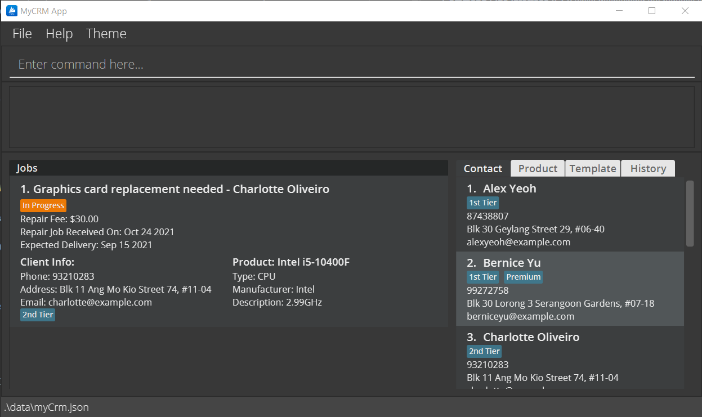

**MyCRM is a desktop application for managing client contacts, repair job statuses, and product information.** It has been optimised for use via a Command Line Interface (CLI) while maintaining the benefits of a Graphical User Interface (GUI). 

**Target Audience:** Tech savvy computer repair shop technician. Owns a business repairing computers and laptops,
actively servicing multiple clients and answering their queries. Services a wide range of models and deals with both
hardware and software issues. Also has multiple repair-phases which have to be updated to clients.

**If you type quickly**, MyCRM can complete customer relationship management tasks faster than traditional GUI applications.

* If you are interested in using MyCRM, head over to the [_Quick Start_ section of the **User Guide**](UserGuide.html#quick-start).
* If you are interested about developing MyCRM, the [**Developer Guide**](DeveloperGuide.html) is a good place to start.

**Acknowledgements**

* Libraries used: [JavaFX](https://openjfx.io/), [Jackson](https://github.com/FasterXML/jackson), [JUnit5](https://github.com/junit-team/junit5), [Mailto](https://mailtolink.me/)
